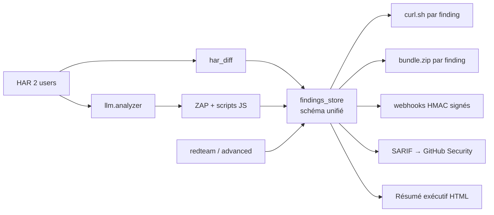

# En quoi HAR-ZAP est innovant

L'innovation de HAR-ZAP ne tient pas aux briques individuelles — ZAP, LLMs, scanners JWT/CORS/GraphQL/WebSocket existent ailleurs. Elle tient à **la chaîne qui va du HAR capturé au rapport exploitable avec interprétation assistée**, et à quelques choix de conception qu'aucun DAST grand public ne fait nativement.

---

## 1. Point de départ HAR, pas URL

Contrairement à ZAP seul ou à Burp qui crawlent le site, HAR-ZAP part de captures réelles (DevTools → Export HAR).

Conséquences directes pour le pentesteur :

- **Scope garanti** dans les parcours utilisateurs réels — pas de pages oubliées parce que le crawler ne les voit pas.
- **Authentification déjà extraite** — les tokens, cookies et headers sont lus depuis la capture, donc le scan a la même session que l'utilisateur.
- **Paramètres corrects** — les IDs, formats JSON, types sont ceux que l'application attend (finis les 400 Bad Request du fuzzing naïf).
- **Spider optionnel** — sur une SPA, le spider ZAP est souvent incomplet ; le HAR évite ça complètement.

Sur une application moderne, cela divise par 10 le temps de reconnaissance.

## 2. Diff HAR deux-utilisateurs → IDOR ciblé

`alice.har + admin.har → modules/har_diff → candidats IDOR auto-classés`.

La plupart des outils IDOR testent à l'aveugle : ils rejouent chaque requête avec un autre token et comparent les réponses. Ici on identifie d'abord :

- les endpoints qui existent **uniquement côté admin** (donc privilégiés),
- les segments d'URL qui ressemblent à des IDs (séquentiels ou opaques ≥ 16 caractères),
- les réponses 2xx à rejouer en priorité.

Résultat : une liste de cibles IDOR pré-classées avant le moindre test.

## 3. LLM comme planificateur, pas comme chatbot

`modules/llm/analyzer.py` produit un `SecurityPlan` JSON structuré :

- domaine inféré (e-commerce, SaaS, banque, etc.) et stratégies adaptées ;
- flows business identifiés (checkout, coupon, race condition) ;
- regex customs extraits par endpoint pour le fuzzing ;
- payloads spécifiques mass assignment par pattern d'URL.

Ce plan alimente **directement** ZAP et les red-team attacks. Burp AI reste un assistant conversationnel. Arachni n'a pas d'équivalent. Ici le LLM pilote réellement les stratégies d'attaque, et son plan est mis en cache par empreinte HAR pour éviter de payer un appel à chaque relance.

## 4. Schéma unifié et corrélation HAR ↔ findings

C'est le cœur de l'innovation.

Toute finding — ZAP, IDOR, red-team, JWT, CORS, GraphQL, WebSocket, passif, LLM — tombe dans un seul store (`modules/findings_store.py`) avec :

- un **fingerprint stable** (plugin + path + evidence, query string ignorée) ;
- une **corrélation vers l'entrée HAR** d'origine (niveau de confiance `exact / normalized / path / domain`) ;
- un **curl reproductible** construit depuis les vrais headers HAR ;
- un **bundle zip** téléchargeable par finding (`request.http`, `response.http`, `curl.sh`, `evidence.txt`, `script_output.txt`) ;
- un **flag false-positive persistant** qui survit aux relances de scan.

Aucun DAST grand public ne fait cette corrélation nativement. Chez les concurrents, relier une alerte ZAP à la requête HAR qui l'a déclenchée est un travail manuel.

## 5. Scan observable avant, pendant, après

**Avant** — dry-run : `cli.py scan --dry-run` (ou checkbox Streamlit « Preview only ») affiche targets, policies, volume estimé de requêtes, durée estimée, warnings (full assault, pas de scope, rate limit bas). Permet d'éviter un scan catastrophique.

**Pendant** — progression live : barre de progression agrégée (cibles × progrès interne), ligne « endpoint en cours », compteur d'alertes par risque mis à jour en temps réel (`scanner.get_scan_progress()`).

**Après** — interprétation prête :

- verdicts explicites (`LIKELY_VULNERABLE z=4.2` pour timing, `VULNERABLE / PARTIAL / NOT_VULNERABLE / NO_TARGETS` pour les attaques avancées) ;
- score de posture passive (note A/B/C/D/F avec justification) ;
- résumé exécutif HTML en tête de rapport (top 3 issues, actions immédiates) ;
- outputs des scripts ZAP JS collectés et affichés (avant ils tournaient en aveugle).

## 6. Vision pédagogique

Rare dans la sécurité offensive. La plupart des outils sont des CLI opaques qui produisent des murs de JSON.

HAR-ZAP impose :

- une **charte didactique** (`CLAUDE.md`) — expliquer le *pourquoi* de chaque attaque, pas seulement le comment ;
- une **interface bilingue** anglais/français (`modules/i18n.py`, `locales/*.json`) pour l'usage en formation ;
- des **commentaires sur le pourquoi non-évident** (contraintes de sécurité, heuristiques DAST, pièges ZAP) ;
- **des diagrammes Mermaid exclusivement** (pas d'ASCII) parce que Mermaid se rend et se modifie, ASCII se casse à la moindre édition ;
- **des accents français obligatoires** sur tout texte en français, partout dans le code.

## 7. Intégration prête à l'emploi

Pas besoin d'écrire du code de glue pour intégrer HAR-ZAP à un pipeline SecOps :

- `/api/v1/findings` REST unifié pour dashboard / SIEM ;
- `/api/v1/findings/{id}/bundle.zip` pour attacher une preuve à un ticket Jira ;
- webhooks sortants signés HMAC-SHA256 (`X-HARZAP-Signature`) vers Slack / Teams / Discord / systèmes internes ;
- SARIF → upload direct vers GitHub Advanced Security ;
- JUnit → reporting CI/CD standard ;
- critères d'acceptation `--fail-fast --max-high 0` pour bloquer les merges ;
- `--dry-run` pour que le pipeline prévisualise ce qu'il va faire.

---

## Ce qui n'est PAS innovant

Pour être honnête : les scanners JWT / CORS / cache poisoning / HTTP smuggling / GraphQL / WebSocket individuels existent dans sqlmap, ffuf, jwt_tool, graphql-playground, etc. ZAP natif, le rate limiting, le lifecycle Docker, le mapping OWASP Top 10 sont des standards de l'écosystème DAST.

Ce qui change, c'est la **couche d'orchestration et d'interprétation** posée au-dessus :

| Sans cette couche | Avec HAR-ZAP |
|---|---|
| N outils séparés à lancer à la main | 1 plateforme, 1 HAR, 1 rapport |
| Scope flou, crawler incomplet | Scope réel issu du parcours utilisateur |
| Alertes sans contexte | Findings corrélés au HAR, curl prêt à l'emploi |
| « Trouve quelque chose » | Plan d'attaque IA priorisé par domaine |
| Résultats opaques | Verdicts interprétés + bundles d'évidence |
| Relance = tout rebruiter | Marquage FP persistant, dédup par fingerprint |
| Intégration = script maison | REST + webhooks + SARIF prêts |

---

## Synthèse en une phrase

HAR-ZAP transforme une plateforme qui « déclenche des choses » en une plateforme qui **produit un rapport exploitable par un pentesteur junior** — grâce à une chaîne unifiée HAR → plan LLM → scans ZAP + Python → findings corrélés avec curl et bundle → interprétation assistée → intégrations clé-en-main.
