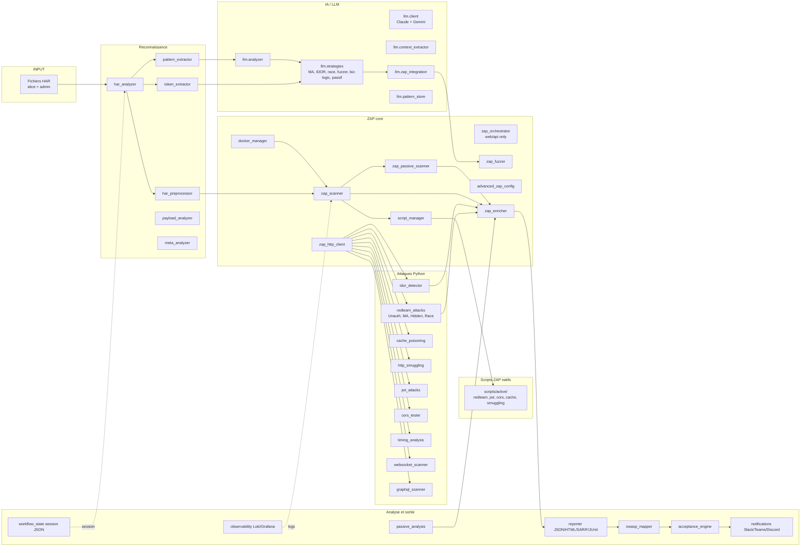
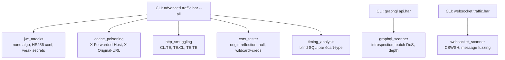
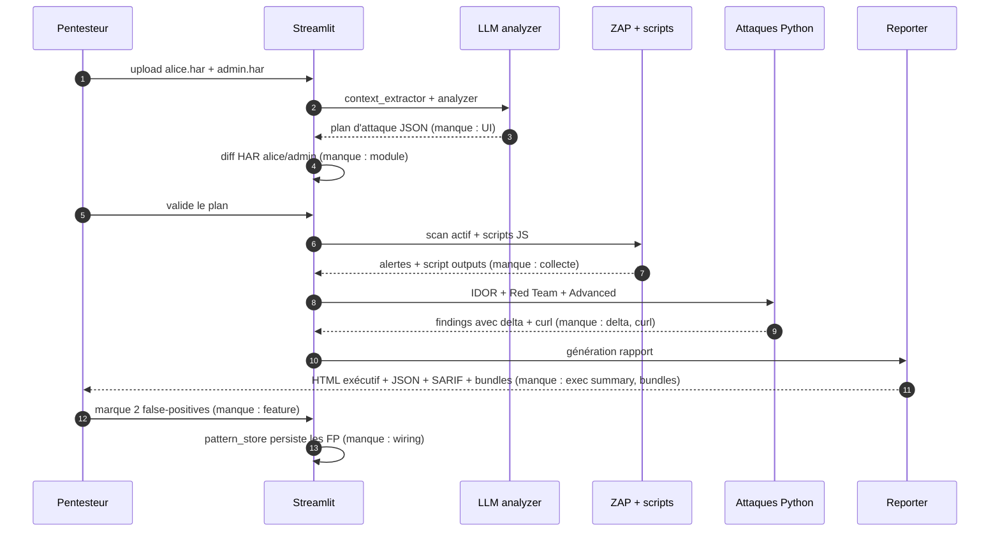
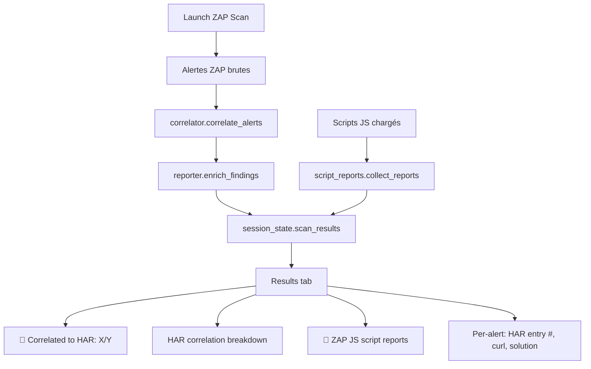

# Plan de pentest avec HAR-ZAP (mode didactique)

> **État du plan au 2026-04-18** : les gaps P0 (corrélation HAR↔alertes, collecte des outputs des scripts ZAP JS, curl de reproduction, verdict timing, score posture passif, diff HAR) ont été **implémentés** et branchés dans Streamlit. Voir §8 « Statut des implémentations ».


Ce document décrit un pentest complet d'une application web réaliste en utilisant **toutes les fonctionnalités** de HAR-ZAP (Streamlit, CLI, modules Python, scripts ZAP JS, LLM). Il sert deux buts :

1. **Dérouler un scénario d'attaque structuré** de la reconnaissance au rapport final.
2. **Identifier les manques de l'application** (retours API, diagnostics, interprétation des résultats) qui rendent aujourd'hui difficile l'exploitation des résultats par un pentesteur.

> Public : hacker éthique ayant une autorisation de test sur la cible. Aucun contenu destructif — chaque étape est défensive/éducative.

---

## 1. Cible fictive et autorisation

**Cible** : `shop.acme.test` — SaaS e-commerce B2C avec :
- Frontend Next.js (SPA, auth JWT, WebSocket pour notifications)
- API REST `/api/v1/*` + point d'entrée GraphQL `/graphql`
- Comptes : `alice@acme.test` (client), `admin@acme.test` (admin)
- Fonctionnalités : catalogue, panier, commande, code promo, profil, support chat

**Autorisation** (fictive) : pentest en pré-prod avec périmètre `shop.acme.test` et `api.acme.test`. Hors scope : prod, CDN tiers, analytics.

---

## 2. Inventaire exhaustif des capacités HAR-ZAP



### 2.1 Entrées utilisateur attendues

| Phase | Entrée | D'où ça vient |
|---|---|---|
| Reconnaissance | HAR du parcours utilisateur | DevTools navigateur, F12 → Network → Export HAR |
| IDOR | HAR utilisateur A + HAR utilisateur B | 2 captures, 2 comptes différents |
| Config | `config.yaml` + `.env` (clés API LLM) | copie depuis `config.yaml.example` |
| Clé API LLM | `HARZAP_GEMINI_API_KEY` ou `HARZAP_ANTHROPIC_API_KEY` | console provider |

### 2.2 Sorties produites

- Alertes ZAP enrichies (CWE, CVSS, remédiation)
- Findings Python (IDOR, race, JWT, CORS, cache, smuggling)
- Rapports `output/report_<timestamp>.{json,html,sarif,junit}`
- Mapping OWASP Top 10
- `output/session.json` (workflow persistence)
- Dashboards Grafana si `make observability-up`

### 2.3 Liste des modules utilisables dans un pentest complet

**Reconnaissance & parsing** : [har_analyzer.py](modules/har_analyzer.py), [har_preprocessor.py](modules/har_preprocessor.py), [token_extractor.py](modules/token_extractor.py), [pattern_extractor.py](modules/pattern_extractor.py), [payload_analyzer.py](modules/payload_analyzer.py), [meta_analyzer.py](modules/meta_analyzer.py)

**ZAP** : [docker_manager.py](modules/docker_manager.py), [zap_scanner.py](modules/zap_scanner.py), [zap_orchestrator.py](modules/zap_orchestrator.py), [zap_fuzzer.py](modules/zap_fuzzer.py), [zap_passive_scanner.py](modules/zap_passive_scanner.py), [zap_http_client.py](modules/zap_http_client.py), [script_manager.py](modules/script_manager.py), [advanced_zap_config.py](modules/advanced_zap_config.py), [zap_enricher.py](modules/zap_enricher.py)

**Attaques Python** : [redteam_attacks.py](modules/redteam_attacks.py) (Unauth, MassAssignment, HiddenParams, Race), [idor_detector.py](modules/idor_detector.py), [cache_poisoning.py](modules/cache_poisoning.py), [http_smuggling.py](modules/http_smuggling.py), [jwt_attacks.py](modules/jwt_attacks.py), [cors_tester.py](modules/cors_tester.py), [timing_analysis.py](modules/timing_analysis.py), [websocket_scanner.py](modules/websocket_scanner.py), [graphql_scanner.py](modules/graphql_scanner.py)

**Analyse défensive** : [passive_analysis.py](modules/passive_analysis.py), [owasp_mapper.py](modules/owasp_mapper.py), [acceptance_engine.py](modules/acceptance_engine.py)

**LLM / IA** : [modules/llm/client.py](modules/llm/client.py), [analyzer.py](modules/llm/analyzer.py), [context_extractor.py](modules/llm/context_extractor.py), [zap_integration.py](modules/llm/zap_integration.py), [pattern_store.py](modules/llm/pattern_store.py), [strategies/](modules/llm/strategies/) (mass_assignment, idor, race_condition, business_logic, fuzzer, passive), [prompts/](modules/llm/prompts/)

**Scripts ZAP natifs** : [scripts/active/redteam_scanner.js](scripts/active/redteam_scanner.js), [jwt_scanner.js](scripts/active/jwt_scanner.js), [cors_scanner.js](scripts/active/cors_scanner.js), [cache_scanner.js](scripts/active/cache_scanner.js), [smuggling_scanner.js](scripts/active/smuggling_scanner.js), [mass_assignment.js](scripts/active/mass_assignment.js), [unauth_replay.js](scripts/active/unauth_replay.js)

**Interfaces** : [app.py](app.py) (Streamlit, 9 onglets), [cli.py](cli.py) (8 sous-commandes : scan/graphql/websocket/idor/cache/diagnose/advanced), [web/api/](web/api/) (FastAPI REST : `/har`, `/scans`, `/zap`, `/attacks`, `/config`, `/llm`, `/enrich`, `/tor`, `/docs`)

**Sorties** : [reporter.py](modules/reporter.py) (JSON/HTML/SARIF/JUnit), [notifications.py](modules/notifications.py) (Slack/Teams/Discord), [workflow_state.py](modules/workflow_state.py), [deployment/zap_shipper.py](deployment/zap_shipper.py) (Loki/Grafana)

**Payloads** : `payloads/` (630 entrées : injection, xss, traversal, ssrf, auth, misc), `dictionaries/`

---

## 3. Scénario pentest complet

### Phase 0 — Préparation

**Objectif** : capturer le trafic des deux comptes, charger config.

1. Démarrer la cible en pré-prod, créer deux sessions navigateur privées.
2. Avec `alice@` : login, parcourir catalogue, ajouter au panier, appliquer code promo, checkout (annulé avant paiement), visiter profil, envoyer un message support.
3. Avec `admin@` : login, panel admin, éditer un produit, consulter commandes.
4. F12 → Network → Export HAR → `alice.har`, `admin.har`.
5. Éditer `.env` :
   ```
   HARZAP_GEMINI_API_KEY=...
   HARZAP_LLM_BATCH_ENABLED=true
   ```
6. Démarrer : `make start` (ZAP + Streamlit).

**❌ MANQUE** : aucun guide intégré dans l'app pour indiquer *quoi capturer* (parcours minimal pour un HAR exploitable). Le wizard `/api/docs/wizard/steps` existe mais n'est pas exposé dans Streamlit.

---

### Phase 1 — Reconnaissance passive sur le HAR

**Objectif** : comprendre la surface d'attaque sans toucher la cible.

1. Streamlit → onglet **Upload** → charger `alice.har`.
   - `har_analyzer` parse le HAR.
   - `token_extractor` détecte JWT, cookies de session, clés API, anti-CSRF.
   - `pattern_extractor` classe les IDs (séquentiel / UUID / base64 / opaque).
2. Onglet **HAR Preprocessing** → filtrer : exclure statiques, garder les méthodes `GET/POST/PUT/DELETE/PATCH`, restreindre aux domaines in-scope.
3. LLM : appel automatique de `llm.analyzer` via `context_extractor` → produit un plan d'attaque structuré (JSON) : endpoints prioritaires, patterns IDOR potentiels, candidats mass assignment, points de race condition.

**Retour attendu** : vue résumée (nb d'endpoints, auth headers, domaines).

**❌ MANQUES** :
- L'output de `llm.analyzer` n'est **pas affiché** dans Streamlit. Il est stocké via `pattern_store` mais aucune UI ne le rend. Le pentesteur ne voit pas le plan IA.
- Le classement des endpoints par « risque » (fait par `payload_analyzer`) n'est pas exposé visuellement. Pas de tableau trié.
- `token_extractor` extrait les tokens mais ne dit pas lesquels sont *exploitables* (ex. JWT avec `alg:none` possible, cookie sans `HttpOnly`).
- Pas de diff entre `alice.har` et `admin.har` pour mettre en évidence les endpoints privilégiés.

---

### Phase 2 — Scan passif ZAP

**Objectif** : trouver les problèmes de configuration sans envoyer d'attaque.

1. Onglet **Passive Scan** → « Run Passive Analysis ».
   - `passive_analysis.SecurityHeadersAnalyzer` : CSP, HSTS, X-Frame-Options, X-Content-Type-Options, Referrer-Policy, Permissions-Policy.
   - `TokenEntropyAnalyzer` : entropie des JWT/session cookies.
   - `SensitiveDataDetector` : emails, IBAN, tokens leakés dans les réponses.
2. `zap_passive_scanner` (appelé plus tard pendant le scan actif) complètera avec les 50+ passive scanners ZAP natifs.

**Retour attendu** : liste d'issues MEDIUM/LOW par domaine.

**❌ MANQUES** :
- Les issues passives sont rendues par `render_passive_results` mais sans **regroupement par domaine** ni par type. Difficile de savoir « est-ce systémique ou ponctuel ? ».
- Aucun lien cliquable vers la remédiation détaillée (les descriptions existent dans `zap_enricher` mais ne sont pas rendues).
- Pas de score consolidé « posture passive = X/10 ».

---

### Phase 3 — Scan actif ZAP + scripts personnalisés

**Objectif** : lancer un scan actif ciblé sur les endpoints classés prioritaires.

1. Onglet **ZAP Scan** → sélection cibles (priorité issue de la Phase 1).
2. Config :
   - `Scope Domains` : `shop.acme.test, api.acme.test`
   - `Exclude Domains` : CDN, analytics
   - `Scan Types` : SQL Injection, XSS, Path Traversal, SSRF, Command Injection, XXE
   - `FULL ZAP ASSAULT` : décoché (trop bruyant en première passe)
3. `docker_manager` démarre ZAP, `zap_scanner` configure contexte + policies, `script_manager` via `ZAPScanner.load_custom_scripts()` charge automatiquement les 7 scripts JS :
   - `redteam_scanner.js` (mass assignment, unauth replay, race, IDOR combiné)
   - `jwt_scanner.js`, `cors_scanner.js`, `cache_scanner.js`, `smuggling_scanner.js`
4. Exécution : spider + passive + active → `zap_enricher` enrichit les alertes avec CWE/CVSS/remédiation.

**Retour attendu** : alertes ZAP consolidées dans l'onglet **Results**.

**❌ MANQUES MAJEURS** :
- **Pas de feedback temps réel** : barre de progression basique, mais le pentesteur ne voit pas *quel endpoint est en cours*, *quel scanner tourne*, *combien d'alertes levées*. Les logs ZAP existent (`/api/zap/logs`) mais ne sont pas streamés.
- **Aucune vue « corrélation HAR → alerte »** : impossible de savoir si une alerte SQLi concerne l'endpoint `/api/v1/search` vu dans le HAR ou un endpoint découvert par le spider.
- **Les scripts JS ne remontent pas leurs outputs** : `script_manager.get_script_output()` existe mais n'est appelé nulle part dans le flux Streamlit/CLI. Le pentesteur ne sait pas si `redteam_scanner.js` a trouvé quelque chose ou s'il n'a pas tourné.
- **Pas d'affichage des scripts chargés** : `load_custom_scripts()` retourne `{active: 5, passive: 2, failed: 0}` mais l'UI affiche juste « Loaded X scripts », sans détail.

---

### Phase 4 — Détection IDOR sur deux sessions

**Objectif** : vérifier que `alice` ne peut pas accéder aux ressources privilégiées.

1. Onglet **IDOR** → charger `alice.har` (User A) + `admin.har` (User B).
2. `idor_detector` parallélise (`Parallel Workers`) les requêtes d'admin rejouées avec les tokens d'alice.
3. Comparaison : ratio de similarité de contenu, statuts, diff structurel.

**Retour attendu** : liste d'endpoints avec `IDORStatus` (VULNERABLE / SAFE / INCONCLUSIVE) et preuve.

**❌ MANQUES** :
- Le résultat est une liste brute sans **preuve reproductible** (pas de commande `curl` pour rejouer manuellement le test positif).
- Pas de filtre sur le statut (« afficher uniquement VULNERABLE »).
- Pas d'export CSV pour traitement ultérieur.

---

### Phase 5 — Red Team : attaques métier

**Objectif** : tester la logique applicative (ce que ZAP ne voit pas).

1. Onglet **Red Team** → config :
   - UnauthenticatedReplay : replay sans `Authorization`
   - MassAssignment : injection `admin=true`, `role=admin`, `isPremium=true`, `verified=true`
   - HiddenParameters : fuzzing de paramètres non documentés (630 candidats dans `payloads/auth/hidden_params.txt`)
   - RaceCondition : parallélisation sur `/api/v1/coupons/apply` et `/api/v1/checkout`
2. Les attaques passent par `zap_http_client` → tout le trafic est proxifié par ZAP (traçable dans `/api/zap/logs`).
3. LLM `strategies/business_logic.py` peut enrichir la liste de paramètres mass assignment à partir du HAR (ex. détection de `userId` dans `/profile/update` → suggestion de tester `role`, `emailVerified`, `creditLimit`).

**Retour attendu** : findings critiques (coupon rejoué 10x, privilège escaladé, etc.).

**❌ MANQUES** :
- `RaceConditionTester` rapporte « race detected » mais ne donne pas le *delta observable* (ex. « solde attendu 50€, observé 500€ après 10 requêtes parallèles »). Sans ce delta, impossible d'écrire le rapport.
- Les payloads mass assignment générés par LLM ne sont **pas listés dans l'UI** — le pentesteur ne sait pas lesquels ont été testés.
- Pas de bouton « rejouer ce test manuellement » avec la requête exacte.

---

### Phase 6 — Attaques avancées (protocoles et vecteurs spécialisés)

**Objectif** : couvrir les surfaces rarement testées.



**Retour attendu** : findings spécialisés (ex. JWT secret cracké = `secret123`, batch alias DoS sur GraphQL, CSWSH sur `/ws/notifications`).

**❌ MANQUES** :
- Ces attaques sont **uniquement disponibles en CLI**, pas dans Streamlit. Le pentesteur Streamlit doit ouvrir un terminal.
- Pas de corrélation : si `jwt_attacks` craque un secret, aucune suggestion automatique de rejouer tous les scans avec un JWT forgé admin.
- `timing_analysis` retourne des stats (`mean`, `std_dev`) mais aucune aide à l'interprétation (« écart significatif ? p-value ? »).

---

### Phase 7 — Interprétation, reporting, acceptation

**Objectif** : produire un rapport exploitable.

1. Onglet **Results** : filtre par risque, par scanner, par endpoint.
2. `owasp_mapper` classe chaque alerte dans OWASP Top 10 2021 (A01..A10) → score de conformité.
3. Onglet **Acceptance** : critères `max_high=0`, `max_medium=5` → évaluation fail-fast.
4. `reporter` génère JSON + HTML + SARIF (utilisable dans GitHub Advanced Security) + JUnit (CI).
5. `notifications` envoie sur Slack si critique.
6. `workflow_state` sauve tout en `.harzap_session.json` pour reprise ultérieure.

**❌ MANQUES CRITIQUES** :
- **Rapport HTML** : existe mais sans **résumé exécutif** (top 3 vulnérabilités, impact business, effort de remédiation estimé).
- **Pas de preuve par finding** : impossible d'exporter un bundle `finding.zip` avec la requête/réponse, le curl de reproduction, la capture d'écran, l'output du script.
- **Pas de marquage false-positive** : un pentesteur qui confirme qu'une alerte est erronée ne peut pas la marquer pour les runs futurs (ce serait pourtant le cas d'usage idéal pour `pattern_store`).
- **Pas de regroupement par impact** : 10 alertes « missing CSP » sur 10 pages = 1 seul vrai finding, mais l'outil en remonte 10.
- **SARIF** : généré mais non testé contre le schéma officiel SARIF 2.1.0 — risque de rejet par GitHub.

---

## 3b. Matrice des diagnostics — « quand je clique, qu'est-ce que je vois et qu'est-ce qui m'échappe ? »

Cette matrice est la réponse directe à « je déclenche des choses mais je n'ai aucune idée comment interpréter les retours ». Chaque ligne = une action typique du pentesteur, ce qu'il voit actuellement, ce qui se passe en coulisses qu'il ne voit pas, et le fix minimal.

| Action (UI ou CLI) | Ce que tu VOIS aujourd'hui | Ce qui SE PASSE en interne | Ce qu'il faudrait pour interpréter |
|---|---|---|---|
| Streamlit → Upload HAR | « Loaded N requests », IDs/usernames/params extraits | `har_analyzer`, `token_extractor`, `pattern_extractor`, LLM `context_extractor` + `analyzer` (si clé API) s'exécutent | Afficher le plan d'attaque JSON produit par LLM (`llm.analyzer`), les endpoints classés par risque, et un diff HAR si 2 fichiers chargés |
| Streamlit → « Analyze HAR » | Rien de plus que les stats sur les tokens | Stockage dans `session_state.har_data` | Afficher un tableau priorisé « endpoints fuzzables triés », « tokens exploitables (ex: JWT `alg=HS256`) » |
| Streamlit → « Launch ZAP Scan » | Barre de progression 0→100 %, toast final avec nombre d'alertes | Spider ZAP, 50+ scanners passifs, scanners actifs par policy, 7 scripts JS chargés via `script_manager` | Liste des scripts réellement chargés (pas juste le count), endpoint en cours, compteur temps réel par risque, output de chaque script JS |
| ZAP scripts JS chargés | « Loaded 5 active + 2 passive scripts » | Les scripts tournent côté ZAP, accumulent des variables via `scriptVars` | Appeler `script_manager.get_script_output(name)` après le scan et afficher un onglet **Script Reports** (tests tentés, endpoints touchés, findings) |
| Streamlit → « Run IDOR Detection » | Liste d'IDOR trouvés, dropdown par statut | `idor_detector` replay paralléle, `difflib` sur réponses | Preuve par finding (requête/réponse admin vs alice, diff surligné, curl reproducible), filtre « VULNERABLE only » |
| Streamlit → « Launch Red Team Attacks » | « Found N critical issues » | `UnauthenticatedReplay`, `MassAssignment`, `HiddenParameters`, `RaceCondition` via `zap_http_client` | Pour la race : delta observable (« compteur attendu 1, observé 10 »). Pour MA : liste des params testés et lesquels ont été acceptés. Pour Unauth : diff entre réponse authentifiée et non-authentifiée |
| Streamlit → « Run Passive Analysis » | Issues passives listées | `SecurityHeadersAnalyzer`, `TokenEntropyAnalyzer`, `SensitiveDataDetector`, ZAP passive | Regroupement par domaine, score posture X/10, link vers remédiation (`zap_enricher`) |
| CLI `advanced --all` | Stdout avec findings | `jwt_attacks`, `cache_poisoning`, `http_smuggling`, `cors_tester`, `timing_analysis` | Verdict explicite (`VULNERABLE` / `NOT_VULNERABLE` / `NEEDS_MANUAL_REVIEW`) au lieu de stats brutes ; onglet Streamlit équivalent |
| CLI `timing_analysis` | `mean_ms`, `std_dev_ms` par payload | Mesure temporelle répétée, calcul stats | Verdict basé sur Z-score > 3, phrase explicite « réponse au payload `AND SLEEP(5)` significativement plus lente (Z=4.2) » |
| CLI `graphql --introspection` | True/False pour introspection | Query `__schema` envoyée | Si true : lister les types exposés (au moins les sensibles : `User`, `AdminMutation`, `InternalPayment`) |
| CLI `scan --owasp` | Conformité par catégorie A01..A10 | `owasp_mapper` mappe chaque alerte | Score global + explication par catégorie non-conforme |
| CLI `scan --fail-fast --max-high 0` | Exit code 0 ou 1 | `acceptance_engine` compte les alertes | Afficher pourquoi ça fail (« found 3 HIGH alerts, expected max 0 »), pas juste un exit code |
| `workflow_state` (resume) | Boutons Resume / Nouvelle session | Sauvegarde `.harzap_session.json` | Montrer ce qui sera restauré (nb d'alertes, étape en cours), option d'import/export pour partage équipe |

### 3c. Matrice des retours API — « que renvoient les endpoints FastAPI ? »

Les routes REST sous `/api/*` existent mais leurs retours sont soit opaques, soit non exploitables sans appels croisés. Diagnostic action par action :

| Endpoint | Retour actuel | Ce qui manque pour scripter un pentest |
|---|---|---|
| `POST /api/har/upload` | `{har_id, stats}` | Lien vers endpoints détectés, tokens extraits, plan LLM |
| `GET /api/har/summary` | Résumé basique | Priorisation par risque, classe d'IDs (séquentiel / UUID / opaque) |
| `POST /api/scans/` | `{scan_id, status: "running"}` | Pas de WebSocket/SSE pour le progress — il faut poll `/api/scans/{id}` |
| `GET /api/scans/{id}` | `{status, progress, results_count}` | Aucun détail sur l'endpoint en cours, aucune alerte temps réel |
| `GET /api/scans/{id}/results` | Liste d'alertes brutes | Pas de `curl_reproduce`, pas de `har_entry_index` d'origine, pas d'enrichissement CWE/CVSS dans la réponse |
| `GET /api/zap/logs` | Dernières N lignes | Pas de streaming (WebSocket), pas de filtre par niveau |
| `GET /api/zap/alerts` | Alertes ZAP natives | Même que `/api/scans/{id}/results`, dédupliquées ? pas sûr |
| `POST /api/attacks/run` (mass_assignment, idor, race) | `{attack_id, findings}` | Quels params testés ? Quels acceptés ? Delta observé ? |
| `POST /api/attacks/pipeline` | Expose `ZAPOrchestrator` riche (scripts + fuzzer) | Pas utilisé par Streamlit/CLI (qui utilisent la version light `ZAPScanner`) |
| `POST /api/llm/analyze` | Plan d'attaque JSON | Ce retour n'est **pas branché** dans Streamlit (cf. gap G1) |
| `GET /api/llm/plan/{har_hash}` | Plan caché par hash | Pas d'invalidation auto, pas de version |
| `POST /api/enrich/fuzz` | Résultats de fuzzing | Pas de corrélation vers le HAR d'origine |
| Endpoint manquant | — | `GET /api/findings` (vue unifiée toutes sources) |
| Endpoint manquant | — | `GET /api/reports/{id}/bundle.zip` (req/res/curl/script-output par finding) |
| Endpoint manquant | — | `POST /api/findings/{id}/mark-false-positive` (feedback loop) |
| Endpoint manquant | — | `WS /ws/scans/{id}` (progress + alerts en temps réel) |
| Endpoint manquant | — | `POST /api/webhooks` (pour SIEM, CI/CD) |

### 3d. Diagnostics manquants côté logs/observabilité

- `deployment/zap_shipper.py` expédie les logs ZAP vers Loki, mais **il n'y a pas de dashboard Grafana intégré** pour corréler : requête HAR → scan ZAP → alerte → finding exploité.
- Pas de trace d'exécution par finding (« quel module l'a produit, avec quel payload, à quelle heure »).
- `workflow_state` sauve l'état mais pas les *décisions* (ex. pourquoi tel endpoint a été exclu).

---

## 4. Ce qui manque pour qu'un pentest soit vraiment interprétable

### 4.1 Gaps bloquants (empêchent l'exploitation des résultats)

| # | Gap | Impact | Module concerné |
|---|---|---|---|
| G1 | Output LLM non affiché dans Streamlit | Le plan d'attaque IA est invisible | `llm.analyzer` + `app.py` |
| G2 | Outputs des scripts ZAP JS jamais collectés | On ne sait pas ce que `redteam_scanner.js` a vraiment testé/trouvé | `script_manager.get_script_output` non appelé |
| G3 | Aucune corrélation HAR ↔ alertes | Impossible de savoir quel endpoint HAR a déclenché quelle alerte | manquant transverse |
| G4 | Findings sans curl de reproduction | Le rapport n'est pas reproductible | `reporter.py` |
| G5 | Barre de progression opaque | Sur un scan long, rien n'indique où on en est | `app.py` + ZAP API |
| G6 | Race condition sans delta observable | Findings non-exploitables en rapport | `redteam_attacks.RaceConditionTester` |
| G7 | Pas de résumé exécutif | Impossible de présenter au client | `reporter.py` HTML |
| G8 | Pas de marquage false-positive | Chaque run repart à zéro | `pattern_store` sous-exploité |

### 4.2 Gaps d'interprétation (rendent l'outil « magique »)

| # | Gap | Impact |
|---|---|---|
| I1 | `timing_analysis` retourne des stats sans verdict | Le pentesteur doit interpréter `std_dev` manuellement |
| I2 | `token_extractor` liste les tokens mais pas leur exploitabilité | Pas de « ce JWT accepte `alg:none` » |
| I3 | `passive_analysis` sans regroupement/score | 50 issues « CSP manquant » noient le signal |
| I4 | IDOR sans filtre sur `VULNERABLE` | Le résultat est une liste brute |
| I5 | Attaques avancées uniquement CLI | Discontinuité UX Streamlit ↔ terminal |

### 4.3 Gaps d'API (pour scripter des pentests)

| # | Gap | Impact |
|---|---|---|
| A1 | `/api/scans/{id}` ne stream pas les logs ZAP | Impossible de suivre un scan en temps réel côté client |
| A2 | Pas d'endpoint `/api/findings` unifié | Il faut croiser `/api/scans`, `/api/attacks`, `/api/zap/alerts` |
| A3 | Pas d'endpoint `/api/reports/{id}/bundle` | Impossible de récupérer un bundle complet par finding |
| A4 | Pas de webhook sortant « finding.discovered » | Intégration SIEM impossible |
| A5 | `ZAPOrchestrator` (features riches) uniquement exposé via `/api/attacks/pipeline` | CLI et Streamlit utilisent `ZAPScanner` (version light) |

### 4.4 Gaps pédagogiques (le projet se veut didactique)

| # | Gap | Impact |
|---|---|---|
| P1 | Pas de tooltip « pourquoi ce scanner a levé cette alerte » | Le pentesteur ne monte pas en compétence |
| P2 | Pas d'exemple « attaque → preuve → remédiation » par type | Manque de contexte éducatif dans l'UI |
| P3 | Le wizard documenté dans `/api/docs/wizard/steps` n'est pas intégré à Streamlit | Parcours de découverte absent |
| P4 | Pas de « dry-run » qui explique ce qui va se passer avant de l'exécuter | Un débutant lance à l'aveugle |

---

## 5. Recommandations prioritaires pour débloquer l'interprétation

### Priorité P0 (sans ça, un pentest sérieux est impossible)

1. **Corrélation HAR ↔ alertes** : enrichir chaque alerte ZAP avec `source_har_entry_index` et `matched_endpoint`. Module à créer : `modules/correlator.py`. UI : dans l'onglet **Results**, lien cliquable vers la requête HAR d'origine.
2. **Collecte des outputs des scripts ZAP JS** : après le scan, appeler `script_manager.get_script_output(name)` pour chaque script chargé, et afficher dans un sous-onglet **Script Reports**.
3. **Curl de reproduction par finding** : `reporter.py` → ajouter `curl_reproduce` dans chaque entrée du JSON (méthode, URL, headers, body).
4. **Streaming des logs ZAP** : WebSocket `/ws/scan/{id}/logs` existe (`web/api/websockets/scan_monitor.py`) — le brancher dans Streamlit via `st.components.v1.iframe` ou un polling régulier sur `/api/zap/logs`.

### Priorité P1 (qualité de vie)

5. **Résumé exécutif HTML** : top 3 findings + effort de remédiation + posture OWASP → header du rapport HTML.
6. **Diff HAR inter-utilisateurs** : `modules/har_diff.py` (nouveau) qui met en évidence les endpoints/paramètres présents chez admin mais pas chez alice → pipe direct vers IDOR.
7. **Marquage false-positive** : bouton dans **Results**, persistance dans `pattern_store`, ignoré aux runs suivants.
8. **Verdict sur `timing_analysis`** : seuil statistique configurable (Z-score > 3), champ `verdict: LIKELY_BLIND_SQLI / INCONCLUSIVE`.

### Priorité P2 (DX et pédagogie)

9. **Wizard Streamlit** : reprendre le contenu de `/api/docs/wizard/steps` et le rendre dans une sidebar Help.
10. **Dry-run mode** : `cli.py --dry-run` et checkbox Streamlit → affiche le plan (quelles attaques, combien de requêtes estimées) sans exécuter.
11. **Bundle d'évidence par finding** : `/api/reports/findings/{id}/bundle.zip` avec req/res/curl/script-output.
12. **Unifier Streamlit et CLI** : exposer `advanced`, `graphql`, `websocket` dans des onglets Streamlit dédiés.

---

## 6. Exemple concret — comment le pentest aurait dû se dérouler



---

## 7. Checklist avant pentest (état actuel de l'outil)

- [x] Capture HAR alice + admin possible
- [x] LLM configuré (clé API en `.env`)
- [x] ZAP démarre (Docker)
- [x] Scripts JS chargés
- [x] Attaques Python fonctionnelles
- [x] **Outputs scripts JS affichés** ([modules/script_reports.py](modules/script_reports.py) — sous-section dans l'onglet Results)
- [x] **Corrélation HAR ↔ alertes** ([modules/correlator.py](modules/correlator.py) — chaque alerte porte `correlation.har_entry_index`)
- [x] **Curl de reproduction par finding** ([modules/reporter.py](modules/reporter.py) — `generate_curl()` + `enrich_findings()`)
- [x] **Diff HAR inter-utilisateurs** ([modules/har_diff.py](modules/har_diff.py) — aperçu dans l'onglet IDOR)
- [x] **Verdict timing_analysis** ([modules/timing_analysis.py](modules/timing_analysis.py) — `compute_verdict()` basé Z-score)
- [x] **Score posture passif** ([modules/passive_analysis.py](modules/passive_analysis.py) — note A/B/C/D/F + rationale)
- [ ] Plan d'attaque LLM visible dans UI
- [ ] Résumé exécutif
- [ ] Marquage false-positive
- [ ] Streaming logs temps réel
- [ ] Dry-run mode
- [ ] Advanced attacks dans Streamlit

**Verdict** : l'outil **déclenche correctement** les phases d'un pentest complet et couvre une surface rare (GraphQL, WebSocket, JWT, smuggling, cache, race condition, IDOR, mass assignment, LLM-guided). Mais il manque la **couche d'interprétation** qui transforme les données brutes en rapport exploitable. Les gaps P0 (corrélation, outputs scripts, curl, streaming logs) sont les bloquants majeurs — sans eux, un pentesteur reste devant un mur de JSON sans savoir quoi en faire.

---

## 8. Statut des implémentations (mise à jour post-code)

### 8.1 Ce qui vient d'être ajouté

| Gap visé | Module créé/modifié | Ce que ça change pour le pentest |
|---|---|---|
| G2 — Scripts JS en boîte noire | [modules/script_reports.py](modules/script_reports.py) (nouveau) | Collecte `scriptVars` + erreurs de chaque script ZAP après scan ; UI `Results → ZAP JS script reports` avec détection `no finding`, `disabled`, `errored`, `findings` |
| G3 — Aucune corrélation HAR ↔ alertes | [modules/correlator.py](modules/correlator.py) (nouveau) | Chaque alerte porte `correlation: {har_entry_index, confidence: exact/normalized/path/domain/none, response_status, request_method, request_url}` ; UI colore chaque finding avec l'index HAR |
| G4 — Findings sans curl reproductible | [modules/reporter.py](modules/reporter.py) : `generate_curl()` rendu public + `enrich_findings()` | Si HAR request dispo, curl intègre méthode + headers réels + body ; ajouté à chaque alerte dans la session Streamlit |
| I1 — `timing_analysis` sans verdict | [modules/timing_analysis.py](modules/timing_analysis.py) : `TimingAnalyzer.compute_verdict()` | Retourne `LIKELY_VULNERABLE / INCONCLUSIVE / NOT_VULNERABLE` avec Z-score et explication en clair |
| I3 — Passif sans regroupement/score | [modules/passive_analysis.py](modules/passive_analysis.py) : `generate_summary()` enrichi | Score 0–10 + note A/B/C/D/F + regroupement par catégorie + rationale |
| P0-6 — Diff HAR inter-utilisateurs | [modules/har_diff.py](modules/har_diff.py) (nouveau) | Expose endpoints `only_in_a`/`only_in_b`, deltas de statut, params privilégiés, candidats IDOR (path contenant un ID + réponse 2xx) ; aperçu dans l'onglet IDOR dès que 2 HAR sont chargés |

### 8.2 Nouveau flux diagnostique côté pentesteur



Ce qui est désormais visible dans l'UI **sans lire aucun JSON** :
- combien d'alertes sont liées à une entrée HAR (exact / path / domain)
- chaque script JS : activé ? en erreur ? findings produits ? output brut ?
- pour chaque alerte : numéro d'entrée HAR d'origine + statut de la réponse captée + curl prêt à coller dans un terminal
- score de posture passif (`7.5/10 (grade B)` + raisonnement)
- verdict timing (`LIKELY_VULNERABLE (Z=4.2)` au lieu de `std_dev=0.1`)
- candidats IDOR pré-classés dès que 2 HAR sont uploadés

### 8.3 Couverture de tests des nouveaux modules

| Module | Tests | Lignes testées |
|---|---|---|
| `correlator.py` | 8 (exact/normalized/path/domain/none, summary, to_dict) | 100% |
| `har_diff.py` | 8 (only_in_a/b, shared, status delta, params, IDOR candidates numeric/UUID/static) | ~95% |
| `script_reports.py` | 12 (parse_output, collect, errored, missing dir, script_var exception, summary) | ~90% |
| `reporter.py` curl | 6 (GET/POST, HAR headers injection, escaping, enrich) | curl path |
| `timing_analysis.compute_verdict` | 7 (samples, clear, moderate, none, zero-variance, custom threshold) | 100% |
| `passive_analysis` posture | 8 (grade A→F, capped penalties, grouped, rationale) | posture path |

Total : **49 nouveaux tests**, **822/822** tests de la suite passent.

### 8.4 Ce qui reste à faire (non fait dans ce sprint)

| Priorité | Gap | Effort estimé |
|---|---|---|
| P0 | Plan d'attaque LLM visible dans Streamlit (G1) | moyen — besoin d'UI + cache LLM |
| P1 | Résumé exécutif HTML (G7) | petit — existe en fonction `generate_executive_summary`, à brancher dans le rapport HTML |
| P1 | Marquage false-positive (G8) | moyen — persistance + UI |
| P1 | Streaming logs ZAP temps réel (G5/A1) | moyen — WebSocket scan_monitor existe, à brancher Streamlit |
| P2 | Dry-run mode | petit |
| P2 | Advanced attacks (JWT, smuggling, cache, GraphQL, WebSocket) exposés dans Streamlit | moyen |
| P2 | Bundle d'évidence zip par finding (A3) | moyen |
| P2 | Endpoint `/api/findings` unifié (A2) | petit |
| P2 | Webhooks sortants (A4) | petit |

### 8.5 Comment valider cette passe

1. `source .venv/bin/activate && pytest tests/ -q` → 822 tests OK
2. `streamlit run app.py` → upload un HAR, lancer un scan ZAP, ouvrir l'onglet **Results** :
   - métrique « 🔗 Correlated to HAR: X/Y »
   - expander « HAR correlation breakdown »
   - expander « 📜 ZAP JS script reports »
   - chaque finding : section « HAR entry: #N · confidence · status », section « Reproduce: curl ... »
3. Onglet **IDOR** → charger 2 HAR → expander « 🔍 HAR diff » avant même de lancer la détection.
