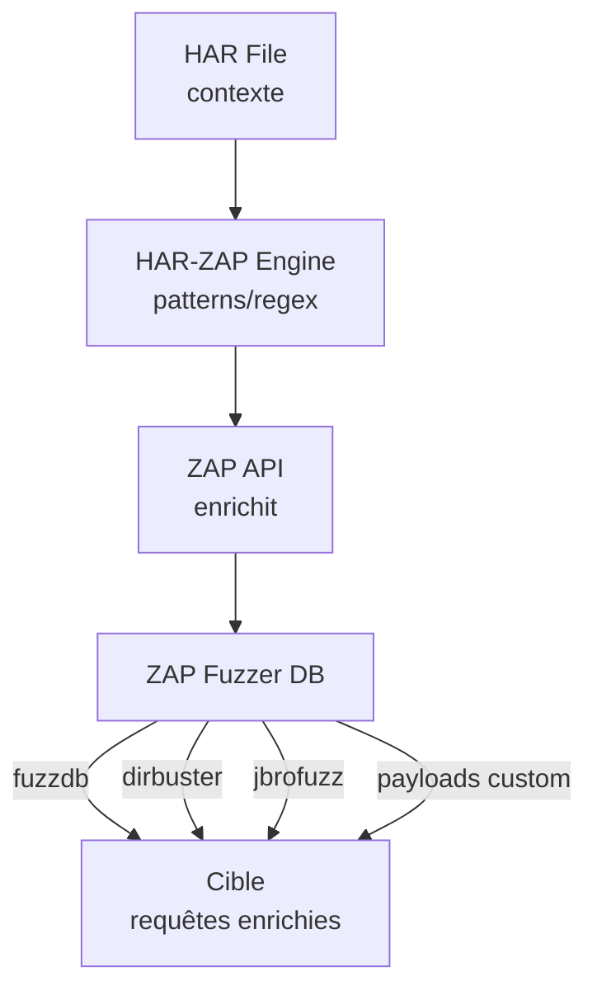

# TODO: ZAP Payload Enrichment Strategy

## Objectif

HAR-ZAP fournit le contexte (HAR, patterns, regex) → ZAP enrichit avec ses listes de payloads → Attaques ciblées

## Architecture Cible



## Phase 1: Extraction de Contexte depuis HAR

### 1.1 Patterns à Extraire
```yaml
# config.yaml ajout
extraction_patterns:
  # IDs numériques
  numeric_id: '\b\d{1,10}\b'
  # UUIDs
  uuid: '[0-9a-f]{8}-[0-9a-f]{4}-[0-9a-f]{4}-[0-9a-f]{4}-[0-9a-f]{12}'
  # Emails
  email: '[a-zA-Z0-9._%+-]+@[a-zA-Z0-9.-]+\.[a-zA-Z]{2,}'
  # JWT tokens
  jwt: 'eyJ[a-zA-Z0-9_-]*\.eyJ[a-zA-Z0-9_-]*\.[a-zA-Z0-9_-]*'
  # Chemins fichiers
  file_path: '(?:\.\.\/)+|(?:\/[a-zA-Z0-9_-]+)+'
```

### 1.2 Service d'Extraction
```python
# web/services/pattern_extractor.py
class PatternExtractor:
    def extract_from_har(self, har_data: Dict, patterns: Dict) -> Dict[str, List[str]]:
        """Extrait les valeurs matchant les patterns du HAR"""
        pass

    def identify_injection_points(self, har_data: Dict) -> List[InjectionPoint]:
        """Identifie les points d'injection (params, headers, body)"""
        pass
```

## Phase 2: Mapping vers ZAP Fuzzer

### 2.1 Listes de Payloads ZAP Disponibles
```
zap.ascan.optionPayloadAll()  # Tous les payloads
zap.ascan.optionInjectables() # Points injectables

# Catégories ZAP:
- jbrofuzz/SQLi/*
- jbrofuzz/XSS/*
- fuzzdb/attack/sql-injection/*
- fuzzdb/attack/xss/*
- dirbuster/directory-list-*
```

### 2.2 Mapping Pattern → Payload List
```yaml
# config.yaml
payload_mapping:
  numeric_id:
    zap_lists:
      - "jbrofuzz/Integer Overflow"
      - "jbrofuzz/IDOR"
    custom: ["0", "-1", "999999", "{{id+1}}", "{{id-1}}"]

  uuid:
    zap_lists:
      - "jbrofuzz/UUID"
    custom: ["00000000-0000-0000-0000-000000000000", "{{uuid_other_user}}"]

  file_path:
    zap_lists:
      - "fuzzdb/attack/path-traversal/*"
      - "jbrofuzz/Path Traversal"
    custom: []

  email:
    custom: ["admin@target.com", "{{email}}@evil.com", "test'--@x.com"]

  jwt:
    custom: ["none_algo", "weak_key", "expired", "other_user"]
```

## Phase 3: Intégration ZAP Fuzzer API

### 3.1 API ZAP à Utiliser
```python
# modules/zap_enricher.py
class ZAPPayloadEnricher:
    def __init__(self, zap: ZAPv2):
        self.zap = zap

    def get_payload_lists(self) -> List[str]:
        """Liste les fichiers de payloads disponibles"""
        return self.zap.fuzzer.listPayloadFiles()

    def load_payloads(self, file_path: str) -> List[str]:
        """Charge un fichier de payloads ZAP"""
        return self.zap.fuzzer.loadPayload(file_path)

    def create_fuzzer(self, url: str, injection_point: str, payloads: List[str]):
        """Crée un fuzzer ZAP avec payloads enrichis"""
        return self.zap.fuzzer.fuzz(
            url=url,
            fuzzLocation=injection_point,
            payloads=payloads
        )

    def enrich_with_zap(self, base_payloads: List[str], category: str) -> List[str]:
        """Enrichit les payloads de base avec ceux de ZAP"""
        zap_payloads = self.load_payloads(f"fuzzdb/attack/{category}/*")
        return list(set(base_payloads + zap_payloads))
```

### 3.2 Script ZAP Custom (Zest/JS)
```javascript
// scripts/enricher.js - Script ZAP pour enrichissement dynamique
function enrich(request, patterns) {
    var enriched = [];

    // Pour chaque pattern trouvé
    patterns.forEach(function(pattern) {
        // Récupère les payloads ZAP correspondants
        var payloads = org.zaproxy.zap.extension.fuzz.payloads
            .getPayloadsForCategory(pattern.category);

        // Génère les variantes
        payloads.forEach(function(payload) {
            var variant = request.clone();
            variant.setParameter(pattern.param, payload);
            enriched.push(variant);
        });
    });

    return enriched;
}
```

## Phase 4: Workflow Complet

### 4.1 Nouveau Endpoint API
```python
# web/api/routes/enrich.py
@router.post("/enrich")
async def enrich_payloads(request: Request, enrich_req: EnrichRequest):
    """
    1. Extrait patterns du HAR
    2. Map vers catégories ZAP
    3. Charge payloads ZAP
    4. Combine avec payloads custom
    5. Retourne payloads enrichis
    """
    pass

@router.post("/fuzz")
async def fuzz_with_enriched(request: Request, fuzz_req: FuzzRequest):
    """
    1. Enrichit payloads
    2. Crée fuzzer ZAP
    3. Lance fuzzing
    4. Stream résultats
    """
    pass
```

### 4.2 Interface UI
```html
<!-- templates/enrich.html -->
<div class="card">
    <h2>Payload Enrichment</h2>

    <div class="form-group">
        <label>Pattern Type</label>
        <select id="pattern-type">
            <option value="numeric_id">Numeric ID (IDOR)</option>
            <option value="uuid">UUID</option>
            <option value="file_path">File Path (LFI/RFI)</option>
            <option value="email">Email</option>
            <option value="custom">Custom Regex</option>
        </select>
    </div>

    <div class="form-group">
        <label>Custom Regex (optionnel)</label>
        <input type="text" id="custom-regex" placeholder="[a-z]{3}\d{4}">
    </div>

    <div class="form-group">
        <label>ZAP Payload Lists</label>
        <select id="zap-lists" multiple>
            <!-- Chargé dynamiquement depuis ZAP -->
        </select>
    </div>

    <button onclick="enrichAndPreview()">Preview Payloads</button>
    <button onclick="launchFuzz()">Launch Fuzzing</button>
</div>
```

## Phase 5: Fichiers à Créer/Modifier

| Fichier | Action | Priorité |
|---------|--------|----------|
| `modules/zap_enricher.py` | Créer | P1 |
| `modules/pattern_extractor.py` | Créer | P1 |
| `web/api/routes/enrich.py` | Créer | P1 |
| `web/templates/enrich.html` | Créer | P2 |
| `config.yaml` | Ajouter extraction_patterns, payload_mapping | P1 |
| `scripts/enricher.js` | Script ZAP custom | P3 |

## Phase 6: Tests

```bash
# 1. Charger HAR
curl -X POST http://localhost:8001/api/v1/har/upload -F file=@capture.har

# 2. Extraire patterns
curl http://localhost:8001/api/v1/enrich/extract

# 3. Preview payloads enrichis
curl -X POST http://localhost:8001/api/v1/enrich/preview \
  -d '{"pattern": "numeric_id", "zap_lists": ["jbrofuzz/IDOR"]}'

# 4. Lancer fuzzing
curl -X POST http://localhost:8001/api/v1/enrich/fuzz \
  -d '{"url": "http://target/api/user/{id}", "pattern": "numeric_id"}'
```

## Notes Techniques

### Listes ZAP Pertinentes
- `fuzzdb/attack/sql-injection/` - SQLi payloads
- `fuzzdb/attack/xss/` - XSS payloads
- `fuzzdb/attack/path-traversal/` - LFI/RFI
- `jbrofuzz/` - Payloads génériques
- `dirbuster/` - Directory brute force

### API ZAP Fuzzer
```python
zap.ascan.scan(url, scanpolicyname, ...)  # Active scan
zap.spider.scan(url)                       # Spider
zap.fuzzer.listPayloadFiles()              # Liste fichiers
zap.fuzzer.loadPayload(file)               # Charge payloads
zap.script.load(name, type, engine, file)  # Scripts custom
```

### Limites
- ZAP doit tourner pour l'enrichissement
- Certains payloads nécessitent contexte (cookies, tokens)
- Rate limiting à gérer côté HAR-ZAP
