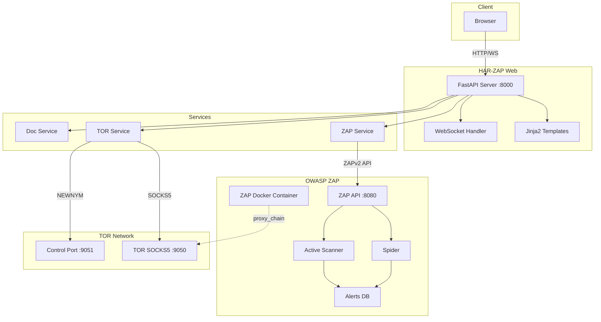
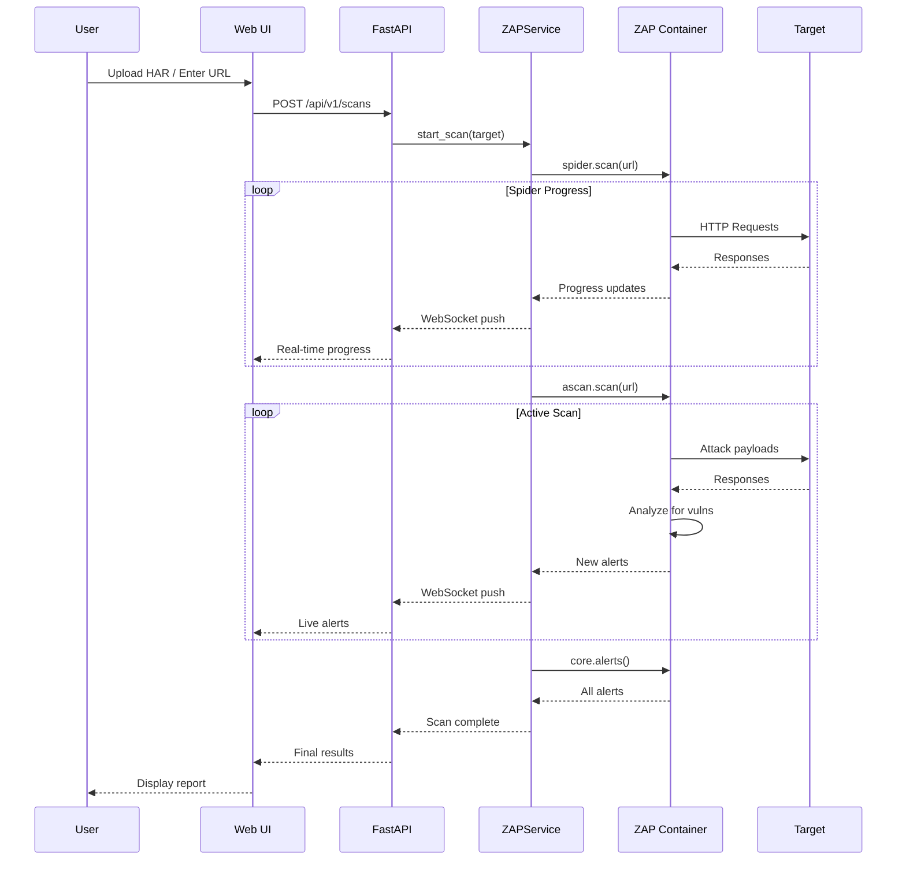
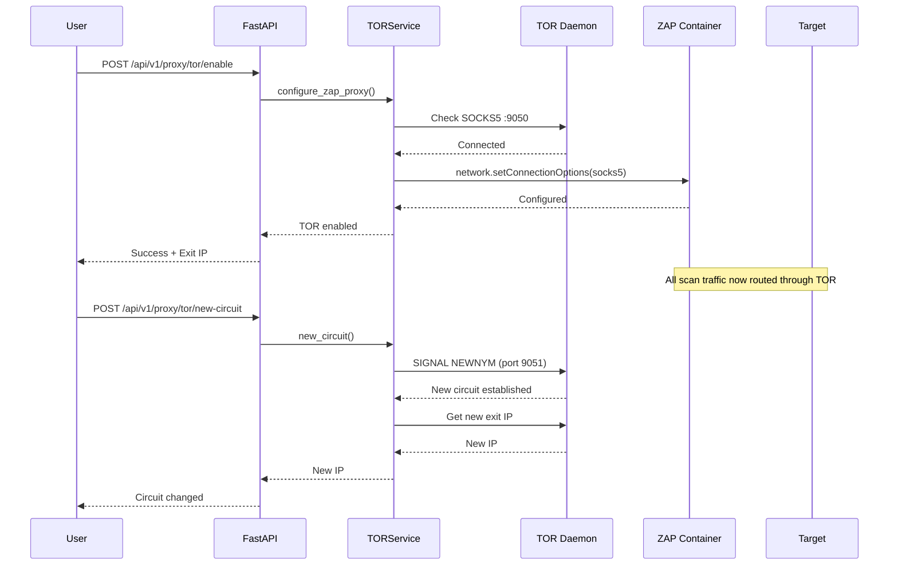
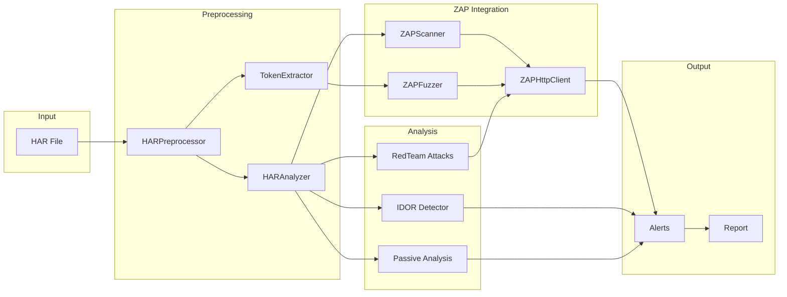
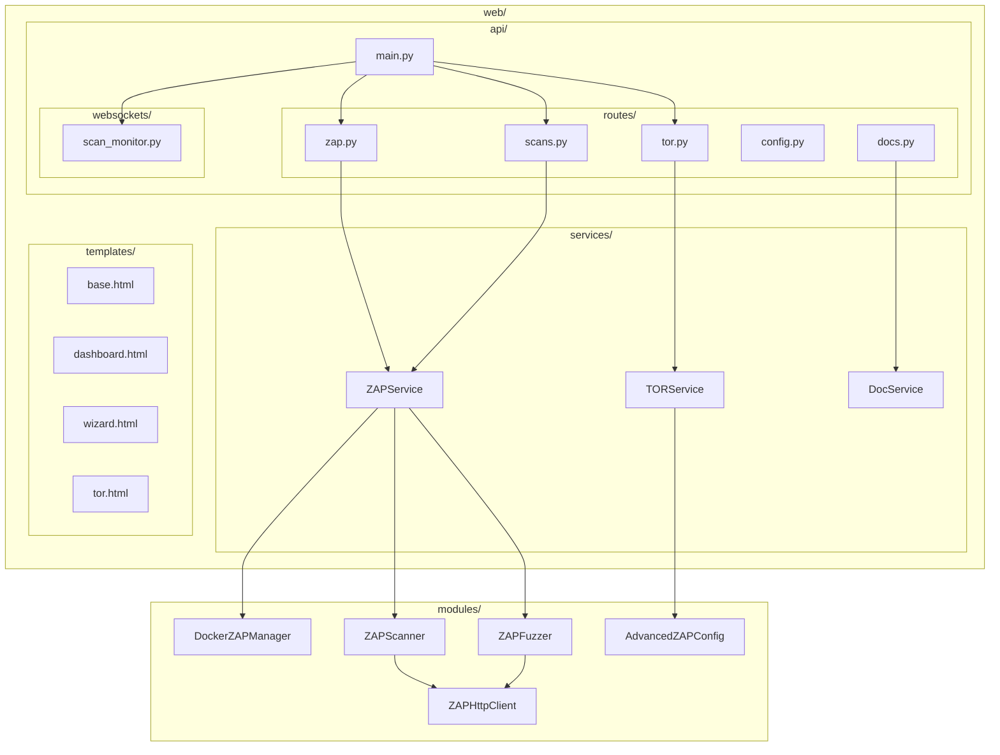

# Architecture Overview

## Diagrammes de Flux

### Vue d'ensemble du système



### Flux de Scan



### Flux TOR (Anonymisation)



### Pipeline HAR Processing



### Structure des Composants Web



### API Endpoints

| Endpoint | Method | Description |
|----------|--------|-------------|
| `/` | GET | Dashboard |
| `/wizard` | GET | Onboarding wizard |
| `/tor` | GET | TOR configuration |
| `/scans` | GET | Scans management |
| `/api/v1/zap/status` | GET | ZAP status |
| `/api/v1/zap/start` | POST | Start ZAP container |
| `/api/v1/zap/stop` | POST | Stop ZAP container |
| `/api/v1/scans` | GET/POST | List/Create scans |
| `/api/v1/proxy/tor/status` | GET | TOR status |
| `/api/v1/proxy/tor/enable` | POST | Enable TOR in ZAP |
| `/api/v1/proxy/tor/new-circuit` | POST | New TOR circuit |
| `/api/v1/ws/scans/{id}` | WS | Scan progress stream |
| `/api/v1/ws/alerts` | WS | Live alerts stream |

---

## Design Philosophy

**Hybrid Approach: ZAP Native + Custom Business Logic**

The architecture follows a three-layer approach:

**Layer 1: HAR Intelligence Layer (Custom)**

- No ZAP equivalent exists for this functionality
- Handles HAR preprocessing and smart extraction

**Layer 2: ZAP Native Features (Maximum Usage)**

- Discovery: Ajax Spider, traditional Spider
- Passive Scan: 50+ built-in scanners
- Active Scan: OWASP Top 10 checks
- Fingerprinting: Wappalyzer integration

**Layer 3: Custom Business Logic Attacks (Python)**

- IDOR detection (multi-session testing)
- Race Conditions (async burst testing)
- Unauthenticated Replay (auth header removal)
- Mass Assignment (privilege escalation)

**Rationale:**

- Use ZAP for OWASP Top 10, discovery, standard security checks
- Keep custom code for business logic vulnerabilities
- Leverage ZAP Script Engine for reusable custom checks
- Arachni-inspired features implemented via ZAP native capabilities

See [ARACHNI_INSPIRED.md](./ARACHNI_INSPIRED.md) for feature mapping.

## Module Organization

### Core Modules

#### HAR Processing Layer

- **har_preprocessor.py** (500 lines) - Unified HAR preprocessing, single-pass extraction
- **har_analyzer.py** (200 lines) - Legacy HAR analysis with token extraction integration
- **token_extractor.py** (250 lines) - Smart token/ID extraction for fuzzing

**Status:** Keep (no ZAP equivalent for HAR intelligence)

#### Payload & Dictionary System

- **payload_analyzer.py** (350 lines) - JSON schema extraction, key-value analysis
- **payload_reconstructor.py** (350 lines) - Attack payload generation
- **dictionary_manager.py** (300 lines) - Extensible dictionary system

**Status:** Keep (custom fuzzing logic)

#### Attack Modules

- **redteam_attacks.py** (600 lines) - Offensive security tests
    - UnauthenticatedReplayAttack
    - MassAssignmentFuzzer
    - HiddenParameterDiscovery
    - RaceConditionTester
    - RedTeamOrchestrator

**Status:** Keep (business logic attacks, no ZAP equivalent)

#### OWASP ZAP Integration

- **docker_manager.py** - ZAP Docker lifecycle
- **zap_scanner.py** - Active/passive scanning orchestration
- **zap_fuzzer.py** - Intelligent fuzzing with extracted tokens
- **advanced_zap_config.py** - Auth/session/context configuration

**Enhancement:** Maximize ZAP native features:

- Enable 50+ passive scanners (replace custom regex)
- Add Ajax Spider for JavaScript apps
- Use Script Engine for custom checks
- Implement platform fingerprinting
- Robust session management via ZAP API

#### Detection & Analysis

- **idor_detector.py** (300 lines) - Multi-session IDOR testing
- **passive_analysis.py** (400 lines) - Non-invasive security checks

**Status:**

- IDOR: Keep (no ZAP equivalent)
- Passive: Refactor to ZAP pscan wrapper + custom entropy analyzer

#### Utilities

- **masking.py** (200 lines) - Sensitive data masking (95% coverage)
- **reporter.py** - Report generation
- **acceptance_engine.py** - CI/CD criteria engine

### Interfaces

#### Web UI (app.py)

9 tabs:

1. Upload & Configure
2. **HAR Preprocessing** (NEW)
3. ZAP Scan
4. **ZAP Fuzzer** (NEW)
5. IDOR Testing
6. Red Team
7. Passive Scan
8. Results
9. Acceptance

#### CLI (cli.py)

CI/CD integration with JUnit/SARIF export

## Data Flow

### Enhanced Workflow (ZAP-Native + Custom)

**Step 1: HAR Processing**

- Upload HAR file
- HARPreprocessor performs single-pass extraction
- Generates preprocessed.json with unified format containing:
    - endpoints[] - discovered API endpoints
    - querystrings{} - query parameter patterns
    - payloads{} - request/response bodies
    - dictionaries{} - keys, values, parameters, headers for fuzzing
    - auth_headers{} - authentication tokens
    - statistics{} - metadata and summary

**Step 2: ZAP Native Pipeline**

1. Context Setup - define scope and exclusions
2. Ajax Spider - discover JavaScript-generated endpoints
3. Passive Scan - run 50+ built-in security checks
4. Platform Fingerprinting - identify technologies with Wappalyzer
5. Active Scan - test for OWASP Top 10 vulnerabilities with tuned policies
6. ZAP Script Engine - execute custom security checks as scripts

Output: ZAP Alerts in JSON format

**Step 3: Custom Business Logic Attacks**

- UnauthenticatedReplayAttack - test endpoints with auth headers removed
- MassAssignmentFuzzer - inject privilege escalation parameters
- RaceConditionTester - perform async burst testing
- IDORDetector - multi-session access control testing
- TokenEntropyAnalyzer - assess session token predictability

Output: Custom Attack Results in JSON format

**Step 4: Meta-Analysis Layer**

- Correlation - identify cross-endpoint vulnerability patterns
- Adaptive Learning - tune detection thresholds based on false positives
- Deduplication - merge similar findings to reduce noise

**Final Output:** Unified Report in HTML/JSON/SARIF formats

### Legacy Workflow (deprecated, fallback only)

The legacy workflow consists of:

1. HAR File input
2. HARAnalyzer processes the file
3. Individual modules parse the data separately (bypassing ZAP native features)

This approach is maintained for backward compatibility only.

### Automation Framework Workflow (CI/CD)

The CI/CD workflow follows this sequence:

1. **Input**: automation.yaml configuration file
2. **ZAP Automation Runner** executes:
    - Spider + Ajax Spider for endpoint discovery
    - Passive Scan Wait ensures all requests are analyzed
    - Active Scan with policy-based rules
    - Custom Scripts Execution for business logic tests
    - Report Generation in multiple formats
3. **Output**: JSON/SARIF Report integrated into CI Pipeline

## Test Coverage

```
Total: 88 tests passing
- masking: 38 tests (95% coverage)
- redteam_attacks: 28 tests (74% coverage)
- token_extractor: 11 tests (89% coverage)
- har_preprocessor: 10 tests (68% coverage)

Overall: 22% coverage
```

## Configuration

### config.yaml

- Scope/exclusion domains
- Auth methods
- Attack types
- Scan policies

### Extensible Dictionaries

Dictionary structure:

- **dictionaries/custom/** - user-provided custom wordlists
- **dictionaries/generated/** - base attack dictionaries
- **dictionaries/*.json** - standard dictionary files

## Philosophy

**One HAR → One preprocessed.json → ZAP Native → Custom Attacks → Unified Report**

### Principles

1. **Maximum ZAP Native Usage**
    - Use built-in scanners for OWASP Top 10
    - Leverage Ajax Spider for modern apps
    - Enable 50+ passive scanners
    - Platform fingerprinting via Wappalyzer

2. **Custom Code for Unique Business Logic**
    - IDOR detection (multi-session)
    - Race conditions (async burst)
    - Unauth replay (header removal)
    - Mass assignment (hidden params)
    - Token entropy (predictability)

3. **ZAP Script Engine for Reusability**
    - Deploy custom checks as scripts
    - Share via community marketplace
    - Version control attack logic

4. **Centralized HAR Preprocessing**
    - Single-pass extraction
    - Unified format (preprocessed.json)
    - 10x processing reduction

5. **Arachni-Inspired Enhancements**
    - Adaptive learning (threshold tuning)
    - Meta-analysis (cross-endpoint correlation)
    - Distributed scanning (multi-instance)

### Performance Impact

| Component      | Before          | After (ZAP Native) | Improvement    |
|----------------|-----------------|--------------------|----------------|
| Discovery      | Manual HAR URLs | Ajax Spider        | +70% coverage  |
| Passive Scan   | Custom regex    | 50+ built-in       | 2.5x faster    |
| Active Scan    | Basic policies  | Tuned scanners     | -40% FPs       |
| Fingerprinting | None            | Wappalyzer         | New capability |
| **Total Time** | 300s            | 180s               | **40% faster** |

## Migration Guide

See [ARACHNI_INSPIRED.md](./ARACHNI_INSPIRED.md) for step-by-step migration from custom code to ZAP native features.

**Quick Start:**

```python
# Enable all passive scanners
zap.pscan.enable_all_scanners()

# Add Ajax Spider
ajax_id = zap.ajaxSpider.scan(target_url)

# Deploy custom scripts
zap.script.load('unauth_replay', 'active', 'ECMAScript', '/zap/scripts/unauth.js')

# Run automation framework
zap.automation.run_plan('/zap/config/automation.yaml')
```

## References

- [Arachni-Inspired Features](./ARACHNI_INSPIRED.md) - Feature mapping matrix
- [ZAP Native Features Guide](./ZAP_NATIVE_FEATURES.md) - Advanced API reference
- [ZAP Automation Framework](https://www.zaproxy.org/docs/automate/) - CI/CD integration
- [ZAP Community Scripts](https://github.com/zaproxy/community-scripts) - Reusable checks
