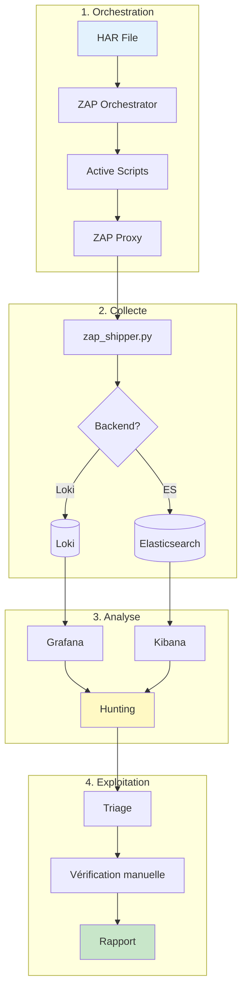
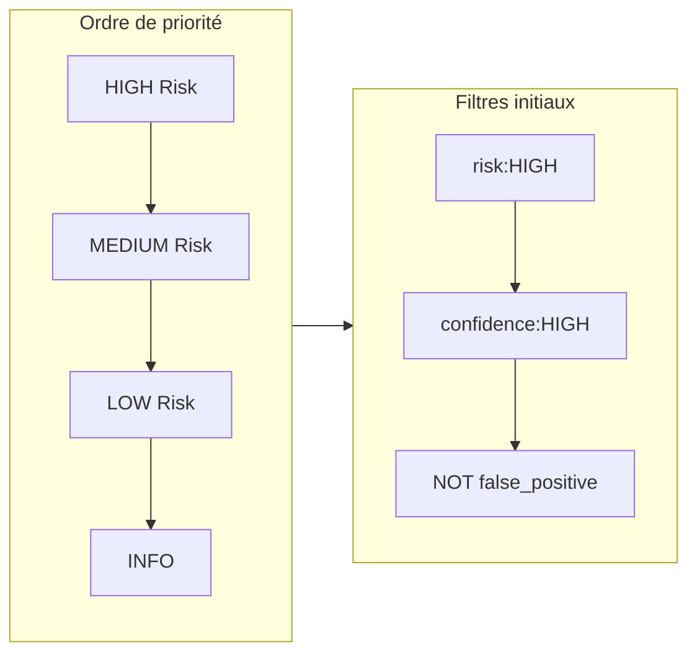
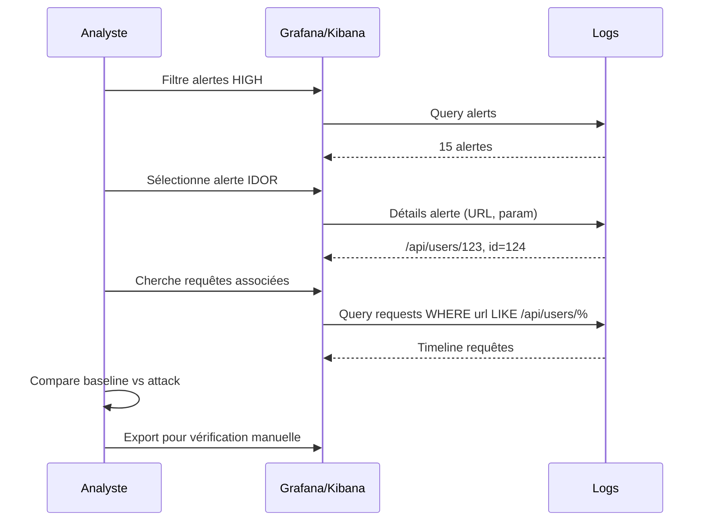
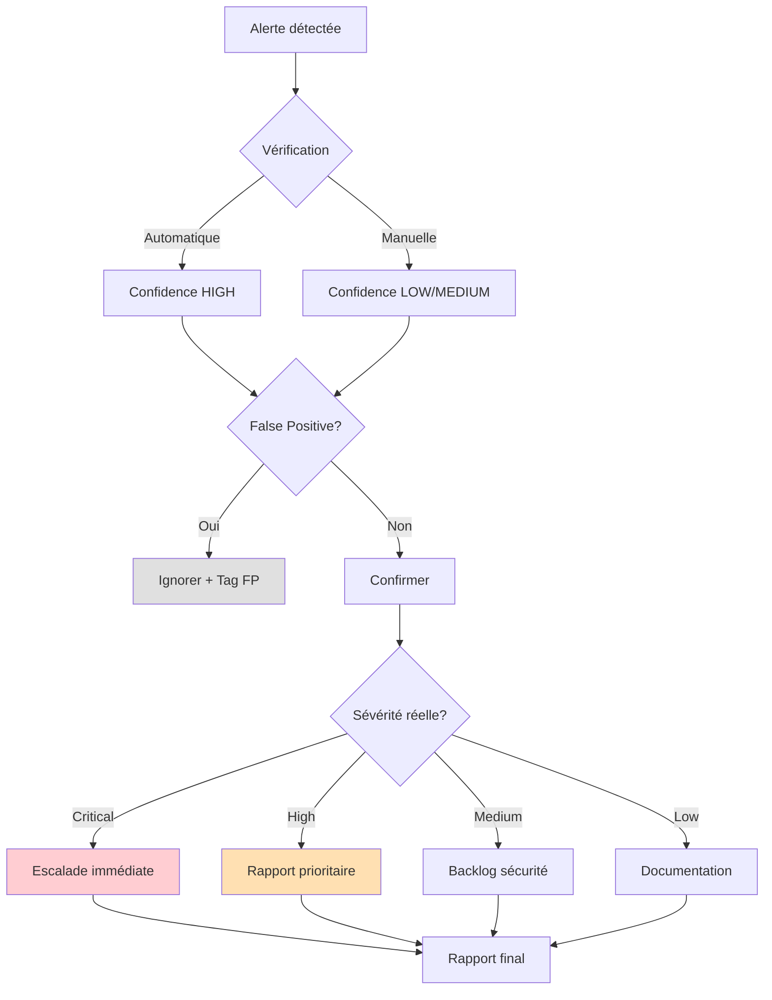
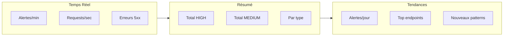
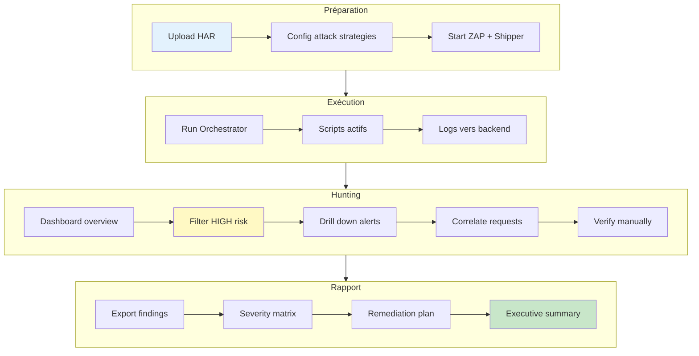

# Guide de Recherche de Vulnérabilités

Après une orchestration d'attaque, comment exploiter les logs pour trouver des failles.

## Workflow Global



## Phase 1: Identifier les alertes critiques



### Requêtes Grafana (Loki)

```logql
# Alertes HIGH uniquement
{job="zap", type="alert", risk="HIGH"}

# Alertes HIGH avec confiance >= MEDIUM
{job="zap", type="alert", risk="HIGH"} | json | confidence =~ "HIGH|MEDIUM"

# Mass Assignment spécifiquement
{job="zap", type="alert"} |= "Mass Assignment"

# IDOR sur endpoints /api/
{job="zap", type="alert"} |= "IDOR" | json | url =~ ".*/api/.*"

# Authentification cassée
{job="zap", type="alert"} |= "Authentication" | json
```

### Requêtes Kibana (Elasticsearch)

```kql
# Alertes HIGH
type:alert AND risk:HIGH

# Mass Assignment avec evidence
type:alert AND name:"Mass Assignment" AND evidence:*admin*

# IDOR sur users
type:alert AND name:*IDOR* AND url:*user*

# Toutes les vulns auth
type:alert AND (name:*auth* OR name:*token* OR name:*session*)
```

## Phase 2: Corréler requêtes et alertes



### Trouver les requêtes associées à une alerte

**Grafana:**
```logql
# Toutes les requêtes vers l'endpoint vulnérable
{job="zap", type="request"} | json | url =~ ".*api/users.*"

# Requêtes avec status 200 (succès suspect)
{job="zap", type="request"} | json | url =~ ".*api/users.*" | status = "200"

# Timeline autour d'une alerte (±5min)
{job="zap"} | json | __timestamp__ >= now() - 5m
```

**Kibana:**
```kql
# Requêtes vers endpoint spécifique
type:request AND url:*api/users*

# Avec filtre temporel dans l'UI
type:request AND url:*api/users* AND @timestamp:[now-1h TO now]
```

## Phase 3: Patterns de détection

```mermaid
flowchart TD
    subgraph MASS["Mass Assignment Hunting"]
        MA1["Chercher: param injecté accepté"]
        MA2["Filtrer: response différente baseline"]
        MA3["Vérifier: privilege escalation réelle?"]
        MA1 --> MA2 --> MA3
    end

    subgraph AUTH["Broken Auth Hunting"]
        AU1["Chercher: requests sans auth header"]
        AU2["Filtrer: status 2xx"]
        AU3["Vérifier: données sensibles exposées?"]
        AU1 --> AU2 --> AU3
    end

    subgraph RACE["Race Condition Hunting"]
        RC1["Chercher: requêtes parallèles"]
        RC2["Filtrer: même endpoint, même seconde"]
        RC3["Vérifier: état incohérent?"]
        RC1 --> RC2 --> RC3
    end

    subgraph IDOR["IDOR Hunting"]
        ID1["Chercher: IDs modifiés"]
        ID2["Filtrer: réponse différente"]
        ID3["Vérifier: données autre user?"]
        ID1 --> ID2 --> ID3
    end
```



### Queries par type de vulnérabilité

#### Mass Assignment

```logql
# Grafana: Paramètres admin/role injectés
{job="zap", type="alert"} | json | param =~ "admin|role|privilege|permission"

# Avec evidence de changement
{job="zap", type="alert"} |= "Mass Assignment" | json | evidence =~ ".*granted.*|.*admin.*|.*elevated.*"
```

```kql
# Kibana
type:alert AND name:"Mass Assignment" AND param:(admin OR role OR privilege)
```

#### Broken Authentication

```logql
# Grafana: Endpoints accessibles sans auth
{job="zap", type="alert"} |= "Unauthenticated" | json

# Tokens invalides acceptés
{job="zap", type="alert"} |= "Invalid Token" | json
```

```kql
# Kibana
type:alert AND (name:*Unauthenticated* OR name:*Invalid Token*)
```

#### Race Condition

```logql
# Grafana: Alertes race avec succès multiples
{job="zap", type="alert"} |= "Race Condition" | json

# Requêtes groupées par timestamp (même seconde)
{job="zap", type="request"} | json | __timestamp__ > now() - 1m
  | pattern `<method> <url>`
  | count by (url, method)
```

```kql
# Kibana: Agrégation par endpoint et timestamp
type:request | date_histogram(@timestamp, 1s) | terms(url)
```

#### IDOR

```logql
# Grafana: IDOR avec différence de contenu
{job="zap", type="alert"} |= "IDOR" | json

# Requêtes avec IDs numériques modifiés
{job="zap", type="request"} | json | url =~ ".*/[0-9]+.*"
```

```kql
# Kibana
type:alert AND name:*IDOR* AND evidence:*

# Requêtes avec IDs
type:request AND url:/.*\/[0-9]+.*/
```

## Phase 4: Triage et vérification



### Checklist de vérification

| Vulnérabilité | Vérification manuelle |
|---------------|----------------------|
| Mass Assignment | Rejouer requête avec param → vérifier persistance en base |
| Broken Auth | Tester endpoint sans header → données sensibles? |
| Race Condition | Burp Turbo Intruder → double spending réel? |
| IDOR | Changer ID → accès données autre utilisateur? |

### Commandes de vérification

```bash
# Rejouer une requête ZAP
curl -X POST "http://localhost:8080/JSON/core/action/sendRequest/" \
  -d "request=POST /api/users HTTP/1.1\r\nHost: target.com\r\n..."

# Export alertes pour rapport
curl "http://localhost:8080/JSON/core/view/alerts/" | jq '.alerts[] | select(.risk == "3")'

# Générer rapport HTML
curl "http://localhost:8080/OTHER/core/other/htmlreport/" > report.html
```

## Phase 5: Dashboards de monitoring



### Panels Grafana recommandés

1. **Stat Panel**: Compteurs HIGH/MEDIUM/LOW
2. **Pie Chart**: Distribution par type d'attaque
3. **Logs Panel**: Stream temps réel filtré
4. **Time Series**: Alertes par heure
5. **Table**: Top 10 endpoints vulnérables
6. **Bar Gauge**: Confiance par alerte

## Exemples de recherches avancées

### Trouver des patterns d'attaque réussis

```logql
# Grafana: Séquence login → action privilégiée
{job="zap", type="request"}
  | json
  | url =~ ".*(login|auth).*"
  | line_format "{{.method}} {{.url}} {{.status}}"

# Suivi: même session, endpoint admin
{job="zap", type="request"}
  | json
  | url =~ ".*admin.*"
  | status = "200"
```

### Détecter des anomalies de réponse

```logql
# Réponses anormalement longues (data leak?)
{job="zap", type="request"}
  | json
  | response_length > 100000

# Réponses différentes pour même endpoint
{job="zap", type="request"}
  | json
  | url = "/api/users/me"
  | response_length != 1234  # baseline connu
```

### Timeline d'une attaque

```logql
# Toute l'activité sur un endpoint dans les 10 dernières minutes
{job="zap"}
  | json
  | url =~ ".*vulnerable-endpoint.*"
  | __timestamp__ >= now() - 10m
  | line_format "{{.__timestamp__}} [{{.type}}] {{.method}} {{.status}} {{.name}}"
```

## Workflow complet en une image



## Ressources

- [Grafana LogQL Documentation](https://grafana.com/docs/loki/latest/logql/)
- [Kibana KQL Documentation](https://www.elastic.co/guide/en/kibana/current/kuery-query.html)
- [ZAP API Documentation](https://www.zaproxy.org/docs/api/)
