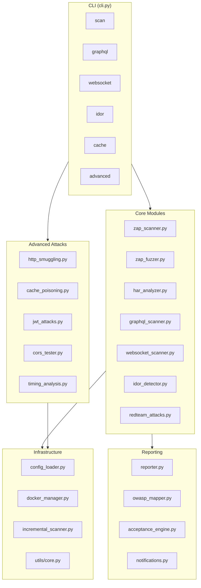

# HAR-ZAP Documentation

> Professional DAST Security Platform for Pentesters and Security Engineers

---

## Quick Navigation

| Section | Description |
|---------|-------------|
| [Getting Started](GETTING_STARTED.md) | First steps, quick start guide |
| [Installation](guides/INSTALLATION.md) | Setup, dependencies, Docker |
| [Configuration](guides/CONFIGURATION.md) | Config file, environment variables |
| [Scanning Guide](guides/SCANNING.md) | Running scans, modes, options |
| [Payloads](guides/PAYLOADS.md) | Payload library, customization |
| [Advanced Attacks](guides/ADVANCED_ATTACKS.md) | Smuggling, JWT, CORS, Cache |
| [CLI Reference](api/CLI.md) | Command line interface |
| [Modules API](api/MODULES.md) | Python API reference |
| [CI/CD Integration](examples/CICD.md) | GitHub Actions, GitLab CI |
| [GraphQL Testing](examples/GRAPHQL.md) | GraphQL security testing |

---

## Architecture Overview



---

## Features Matrix

| Feature | Description | Status |
|---------|-------------|--------|
| HAR-based scanning | Scan from recorded traffic | ✅ |
| Docker ZAP orchestration | Auto-start/stop ZAP | ✅ |
| Active scanning | SQL, XSS, injection testing | ✅ |
| Passive scanning | Headers, PII, entropy | ✅ |
| IDOR detection | Multi-session access control | ✅ |
| GraphQL testing | Introspection, batching, depth | ✅ |
| WebSocket testing | CSWSH, auth, injection | ✅ |
| Incremental scanning | Cache-based delta scans | ✅ |
| OWASP Top 10 mapping | Compliance reporting | ✅ |
| CI/CD integration | SARIF, JUnit, fail-fast | ✅ |
| Webhook notifications | Slack, Teams, Discord | ✅ |
| Rate limiting | Configurable request rate | ✅ |
| Custom payloads | Hierarchical payload library | ✅ |
| HTTP Smuggling | CL.TE, TE.CL, TE.TE detection | ✅ |
| Cache Poisoning | Unkeyed header injection | ✅ |
| JWT Attacks | None alg, weak secrets, confusion | ✅ |
| CORS Testing | Origin reflection, bypass | ✅ |
| Timing Analysis | Blind injection via timing | ✅ |

---

## Quick Start

```bash
# 1. Install dependencies
pip install -r requirements.txt

# 2. Run scan with HAR file
python cli.py scan traffic.har --owasp --fail-fast --max-high 0

# 3. View results
cat output/scan_report_*.json
```

→ [Full Getting Started Guide](GETTING_STARTED.md)

---

## Support

- Issues: GitHub Issues
- Security: security@example.com
