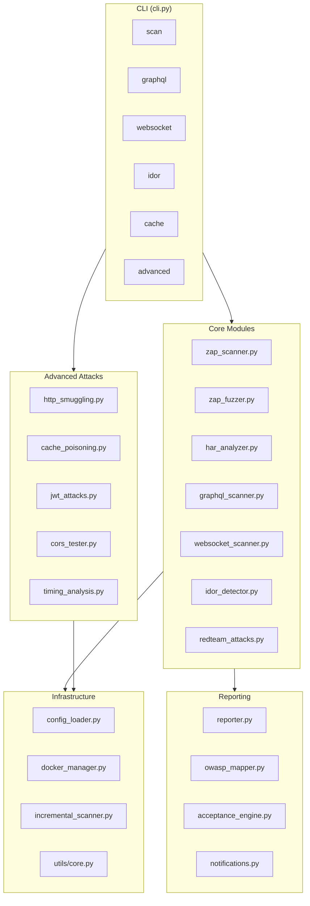

# HAR-ZAP Documentation

> Professional DAST Security Platform for Pentesters and Security Engineers

[← Back to repo root](../README.md) · [QUICKSTART](../QUICKSTART.md) · [PENTEST walkthrough](../PENTEST.md) · [CLAUDE charter](../CLAUDE.md)

---

## Quick Navigation

### Start here
| Doc | What it covers |
|---|---|
| [GETTING_STARTED.md](GETTING_STARTED.md) | 5-minute first-scan walkthrough |
| [HOWTO.md](HOWTO.md) | Step-by-step recipes for common tasks |
| [INNOVATION.md](INNOVATION.md) | What makes HAR-ZAP different from ZAP/Burp/Arachni |

### Guides
| Doc | What it covers |
|---|---|
| [guides/INSTALLATION.md](guides/INSTALLATION.md) | Setup, dependencies, Docker |
| [guides/CONFIGURATION.md](guides/CONFIGURATION.md) | Config file, environment variables |
| [guides/SCANNING.md](guides/SCANNING.md) | Running scans, modes, options |
| [guides/PAYLOADS.md](guides/PAYLOADS.md) | Payload library, customization |
| [guides/ADVANCED_ATTACKS.md](guides/ADVANCED_ATTACKS.md) | Smuggling, JWT, CORS, Cache, GraphQL, WebSocket |
| [guides/TOR_SETUP.md](guides/TOR_SETUP.md) | Routing scans through TOR |

### References
| Doc | What it covers |
|---|---|
| [api/CLI.md](api/CLI.md) | Command-line interface reference |
| [api/MODULES.md](api/MODULES.md) | Python modules API |
| [ARCHITECTURE.md](ARCHITECTURE.md) | System architecture and module wiring |
| [ZAP_NATIVE_FEATURES.md](ZAP_NATIVE_FEATURES.md) | ZAP features we rely on |
| [PREPROCESSING_GUIDE.md](PREPROCESSING_GUIDE.md) | HAR preprocessing pipeline |

### Deep dives
| Doc | What it covers |
|---|---|
| [HUNTING_GUIDE.md](HUNTING_GUIDE.md) | Vulnerability hunting playbook |
| [redteam/](redteam/) | Red-team attack documentation (MASS_ASSIGNMENT, HIDDEN_PARAMETERS, RACE_CONDITIONS, UNAUTHENTICATED_REPLAY) |
| [community/FINDING_NEIGHBORS.md](community/FINDING_NEIGHBORS.md) | Discovering similar projects for pentest reuse |

### Examples & integrations
| Doc | What it covers |
|---|---|
| [examples/CICD.md](examples/CICD.md) | GitHub Actions, GitLab CI |
| [examples/GRAPHQL.md](examples/GRAPHQL.md) | GraphQL security testing |

### Roadmap & design notes
| Doc | What it covers |
|---|---|
| [ROADMAP_LLM_SECURITY.md](ROADMAP_LLM_SECURITY.md) | LLM-assisted security roadmap |
| [ARACHNI_INSPIRED.md](ARACHNI_INSPIRED.md) | Design inspirations from Arachni |
| [ARACHNI_CODE_ANALYSIS.md](ARACHNI_CODE_ANALYSIS.md) | Detailed Arachni comparison |
| [COHESION_REPORT.md](COHESION_REPORT.md) | Architecture cohesion audit |

---

## Architecture Overview



---

## Features Matrix

| Feature | Description | Status |
|---------|-------------|--------|
| HAR-based scanning | Scan from recorded traffic | ✅ |
| Docker ZAP orchestration | Auto-start/stop ZAP | ✅ |
| Active scanning | SQL, XSS, injection testing | ✅ |
| Passive scanning | Headers, PII, entropy | ✅ |
| IDOR detection | Multi-session access control | ✅ |
| GraphQL testing | Introspection, batching, depth | ✅ |
| WebSocket testing | CSWSH, auth, injection | ✅ |
| Incremental scanning | Cache-based delta scans | ✅ |
| OWASP Top 10 mapping | Compliance reporting | ✅ |
| CI/CD integration | SARIF, JUnit, fail-fast | ✅ |
| Webhook notifications | Slack, Teams, Discord | ✅ |
| Rate limiting | Configurable request rate | ✅ |
| Custom payloads | Hierarchical payload library | ✅ |
| HTTP Smuggling | CL.TE, TE.CL, TE.TE detection | ✅ |
| Cache Poisoning | Unkeyed header injection | ✅ |
| JWT Attacks | None alg, weak secrets, confusion | ✅ |
| CORS Testing | Origin reflection, bypass | ✅ |
| Timing Analysis | Blind injection via timing | ✅ |

---

## Quick Start

```bash
# 1. Install dependencies
pip install -r requirements.txt

# 2. Run scan with HAR file
python cli.py scan traffic.har --owasp --fail-fast --max-high 0

# 3. View results
cat output/scan_report_*.json
```

→ [Full Getting Started Guide](GETTING_STARTED.md)

---

## Support

- Issues: GitHub Issues
- Security: security@example.com
