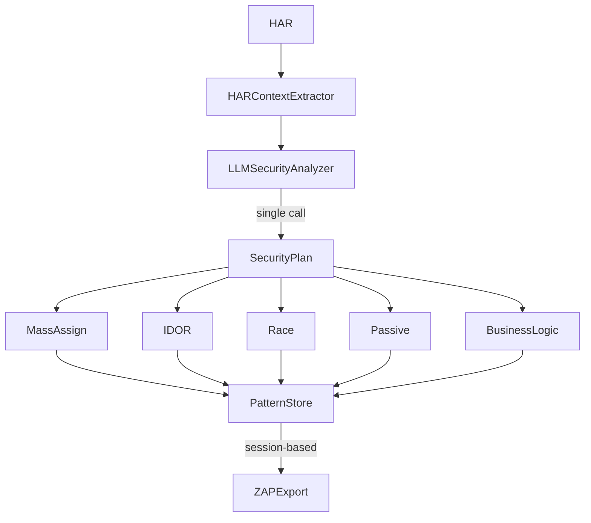

# LLM Security Integration Roadmap

[← Docs index](README.md) · [INNOVATION](INNOVATION.md) · [PENTEST walkthrough](../PENTEST.md)

## Status: Implemented

Branch: `llm`

## Architecture



One LLM call per HAR, cached by hash. Strategies consume the SecurityPlan.

## Modules

| Module | Purpose |
|--------|---------|
| `modules/llm/client.py` | Multi-provider (Anthropic, Gemini), rate limiting |
| `modules/llm/cache.py` | File cache by HAR hash, TTL 24h |
| `modules/llm/context_extractor.py` | Privacy-safe HAR extraction (keys only) |
| `modules/llm/analyzer.py` | SecurityPlan generator |
| `modules/llm/pattern_store.py` | Session-based persistence, ZAP export |
| `modules/llm/strategies/` | Attack-specific enrichment |

## LLM Value per Attack Type

| Attack | LLM Contribution | Impact |
|--------|------------------|--------|
| Fuzzer | Domain-specific vocabulary | High |
| Mass Assignment | Probable model fields | High |
| IDOR | ID format detection, enumeration strategy | High |
| Race Condition | TOCTOU window detection | Very High |
| Passive Analysis | Custom regex per domain | Medium |
| Business Logic | Multi-step flow analysis | Very High |

## Pattern Store

Session-scoped persistence with ZAP integration:

- `patterns/sessions/{timestamp}_{name}/` - Session data (session.json, attack results)
- `patterns/merged/` - Merged patterns
- `patterns/zap_import/` - Import from ZAP
- `patterns/zap_export/fuzzers/` - Export for ZAP fuzzers

Operations: GET / ADD / PERSIST / PUSH

## API Endpoints

```
POST /llm/analyze              # HAR -> SecurityPlan
POST /llm/enrich-and-store     # Full pipeline with persistence
GET  /llm/patterns/sessions    # List sessions
GET  /llm/patterns/current     # Current session
POST /llm/patterns/merge       # Merge all sessions
POST /llm/patterns/{id}/push   # Push to ZAP export
```

## Config

```yaml
llm:
  enabled: true
  provider: "anthropic"  # "anthropic" | "gemini"
  model: "claude-sonnet-4-20250514"
  # Gemini: gemini-1.5-pro, gemini-1.5-flash, gemini-2.0-flash
  max_tokens: 4000
  temperature: 0.1
  batch_enabled: false   # Gemini batch mode (async, 50% cheaper)
  batch_poll_interval: 5.0
  batch_max_wait: 3600
  cache:
    enabled: true
    directory: "./.llm_cache"
    ttl_hours: 24
```

Env vars:
- `HARZAP_LLM_API_KEY` - Anthropic
- `HARZAP_GEMINI_API_KEY` - Gemini
- `HARZAP_LLM_PROVIDER` - provider selection
- `HARZAP_LLM_BATCH_ENABLED` - batch mode

## Privacy

Context extractor sends structure only:
- Endpoint patterns: `/users/{id}`, `/orders/{id}`
- JSON keys: `["user_id", "role", "email"]`
- Parameter names: `["page", "limit", "filter"]`

Never sends actual values.

## ZAP Integration

Docker mount:
```
-v ./patterns/zap_export/fuzzers:/home/zap/.ZAP/fuzzers/llm:ro
```

## TODO

- [ ] CLI command for offline enrichment
- [ ] Rate limiter metrics
- [x] Multi-provider support (Gemini with batch mode)
- [ ] OpenAI provider
- [ ] Local models (Ollama)
