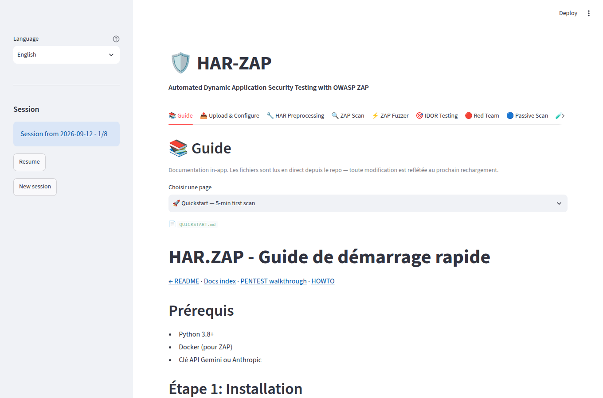
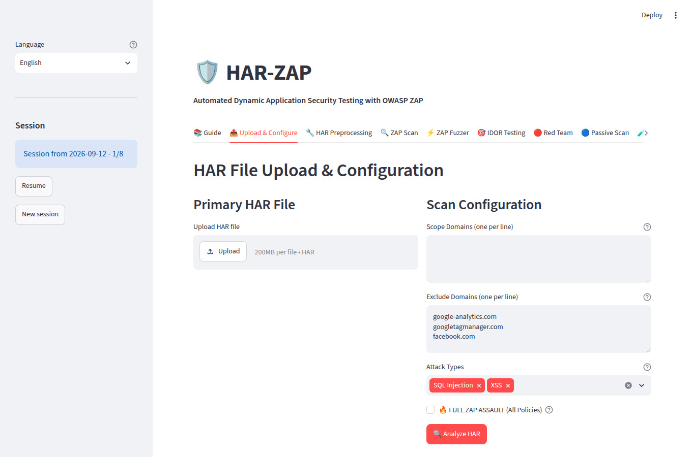
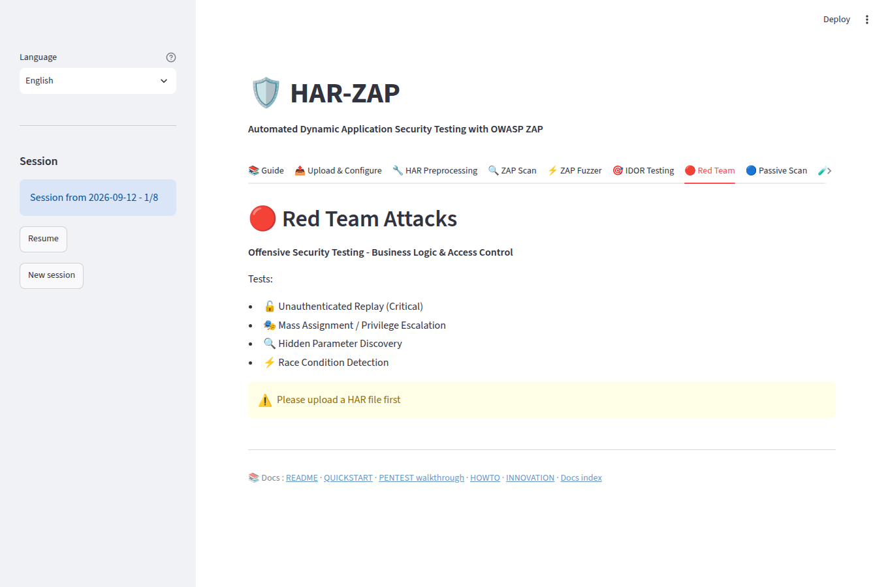
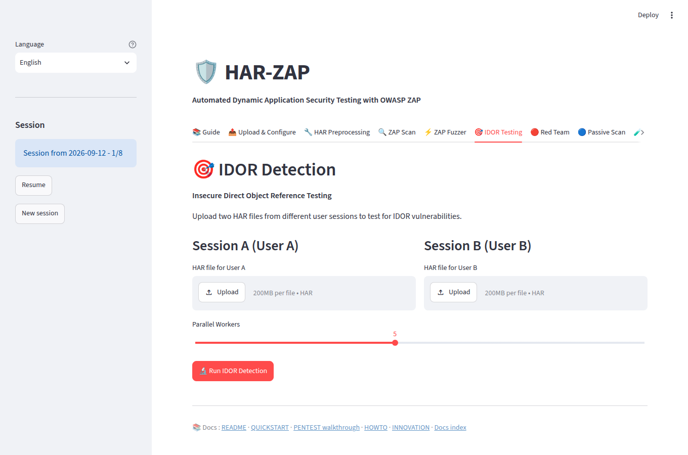
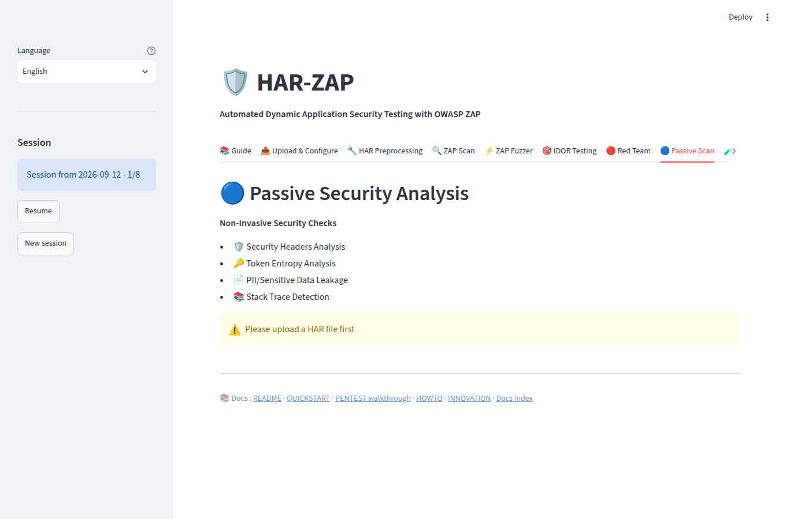
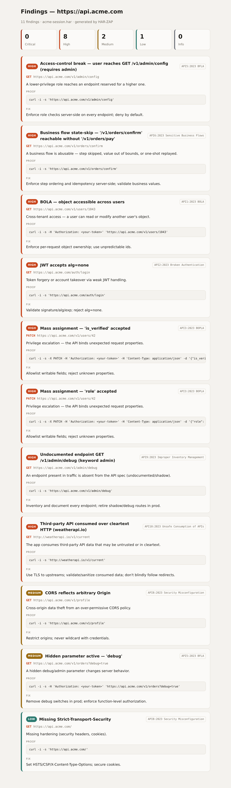
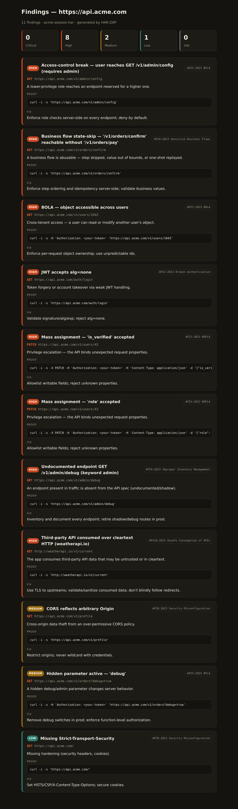

# Web UI tour (Streamlit)

Real screenshots of the HAR-ZAP Streamlit app (`streamlit run app.py`).

## Guide

## Upload & Configure
Upload a HAR, set scope/exclude domains and attack types, then run.

## Red Team
Offensive tests — unauthenticated replay, mass assignment, hidden parameters, race conditions.

## IDOR Testing
Two-session cross-user access-control testing (BOLA / API1).

## Passive Scan
Non-invasive checks — security headers, sensitive-data leaks, token entropy.

## Findings-first report
Severity-sorted, each finding with impact, a replayable curl proof, the fix, and its OWASP API tag.

### Findings-first report — dark theme
The report is theme-aware (follows the viewer's light/dark preference).

