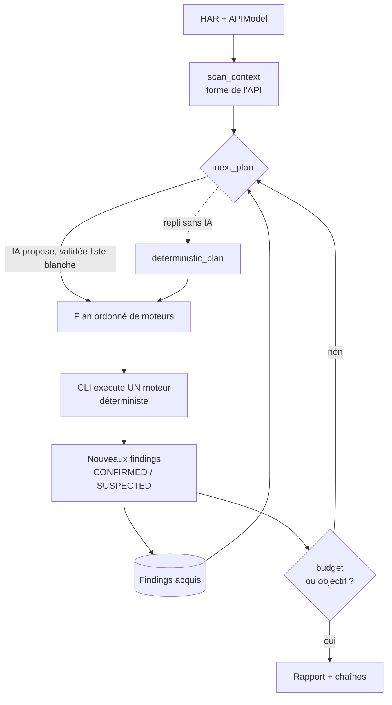

# Étude — Une articulation par IA rendrait-elle le DAST plus agile et flexible ?

**Réponse courte : oui, mais à une place précise.** L'IA doit devenir le *plan de
contrôle* (choisir quoi lancer, dans quel ordre, sur quoi, et réagir aux
découvertes), **jamais** le plan de données (elle ne produit pas les preuves).
C'est la même discipline que le reste du projet — *l'IA propose, le code dispose* —
appliquée cette fois à l'orchestration.

## 1. État actuel : un pipeline figé

Aujourd'hui l'opérateur coche des flags (`--web`, `--injection`, `--investigate`,
`--business-flow`, `--probes`, `--adaptive`) et les moteurs s'exécutent dans un
**ordre fixe**. L'IA n'intervient qu'aux **points de jugement** (adjudication de
near-miss, interprétation mass-assignment, extrapolation de routes, arbitrage
SUSPECTED). C'est robuste et déterministe, mais **rigide** :

- on scanne *tout, pareil*, quelle que soit la cible (une API GraphQL reçoit les
  mêmes sondes qu'une API REST) ;
- on **n'exploite pas** ce qu'on vient de découvrir (un `alg=none` confirmé ne
  déclenche pas automatiquement l'exploration des routes privilégiées) ;
- le périmètre se pilote par flags, pas par intention (« teste seulement le
  billing, sans rien de destructif »).

## 2. Où une articulation par IA ajoute de l'agilité

| Levier | Gain | Existe ? |
|--------|------|----------|
| **Planification** — choisir les moteurs selon la forme de l'API | ne pas tout lancer aveuglément | ❌ (nouveau) |
| **Boucle réactive** — re-planifier après chaque moteur selon les findings | le scan se **reshape** en apprenant | ❌ (nouveau) |
| **Scoping en langage naturel** — « authz only, non destructif » → sélection + contraintes | flexibilité d'usage | ❌ (nouveau) |
| **Synthèse de payloads par endpoint** (dialecte SQL du stack, etc.) | frappe plus juste | ⚠️ partiel (adaptive) |
| **Corrélation findings → chaînes** et follow-up | profondeur d'exploitation | ⚠️ partiel (`exploit_chainer`) |
| **Triage/rapport** — rang, dédup, explication, fix | lisibilité | ⚠️ partiel (owasp_mapper, fp_adjudicator) |

Le **plus gros gain** est la boucle réactive : transformer un pipeline en un
**agent** qui observe puis décide de la suite.

## 3. Architecture proposée — un plan de contrôle

Le plan de contrôle **planifie et réagit** ; l'exécution reste les moteurs
déterministes existants. L'IA ne choisit **que** dans une liste blanche de
moteurs — elle ne peut pas inventer d'action.

## 4. Garde-fous (non négociables)

1. **Souveraineté déterministe.** L'IA ordonne/sélectionne ; elle ne crée jamais
   un verdict `CONFIRMED` (celui-ci reste marqueur/différentiel) et ne peut pas
   annuler un `REFUTED`. Au pire elle ajoute du `SUSPECTED`.
2. **Liste blanche d'actions.** Toute étape proposée est validée contre `ENGINES` ;
   une action inconnue est écartée et loggée. L'IA ne fait pas de requêtes elle-même.
3. **Autorisation.** Le plan de contrôle n'active les chemins offensifs que sous
   attestation (`--i-am-authorized`, préambule système déjà en place).
4. **Déterminisme rejouable + mémoire.** Les décisions passent par la couche
   record/replay, et les découvertes structurelles se persistent (cf. le DSL
   d'auth) : *l'IA décide une fois, les runs suivants rejouent sans appel modèle.*
5. **Coût borné.** Un appel de planification **par phase** (pas par requête), avec
   un budget d'étapes. Hors ligne / sans clé → repli déterministe intégral.
6. **Anti-FP.** Réordonner ne change pas la qualité d'un finding ; l'articulation
   n'assouplit pas les seuils, elle change seulement *l'ordre et le choix*.

## 5. Ce qui est livré (Phase 1)

`modules/llm/orchestrator.py` — un **planificateur pur et testé** :

- `scan_context(har, findings)` : résume la forme de l'API (auth ? écritures ?
  paramètres url-ish ? GraphQL ?) et les findings acquis ;
- `deterministic_plan(ctx)` : l'articulation **de base, sans IA** — déjà plus
  agile qu'un pipeline figé (choisit les moteurs pertinents ET **réagit** :
  `alg=none` → matrice d'accès en priorité 1 ; SSRF → extrapolation interne ;
  fuite de clé/objet → rejeu adaptatif) ;
- `ai_plan(client, ctx)` : l'IA **propose** un plan ordonné ; chaque étape est
  **validée contre la liste blanche** (une action inventée est écartée) ; sans
  client → `None` ;
- `next_plan(...)` : IA si dispo **et** valide, sinon déterministe — **jamais vide**.

Il **planifie** seulement (aucun effet de bord) : le CLI reste maître de
l'exécution. 13 tests couvrent la détection de forme, la réactivité déterministe,
la validation liste blanche et le repli.

## 6. Feuille de route

- **Phase 1 (fait)** — planificateur pur (déterministe + IA-propose-validée) + tests.
- **Phase 2** — brancher `next_plan` dans `run_diagnose` : boucle « planifier → lancer
  un moteur → réinjecter les findings → replanifier », derrière un flag `--auto`
  (les flags manuels restent le mode par défaut).
- **Phase 3** — scoping en langage naturel (`--goal "authz only, non destructive"`
  → contraintes de sélection) et synthèse de payloads par endpoint.
- **Phase 4** — corrélation → follow-up dirigé (un finding déclenche une sonde
  ciblée), fusion avec `exploit_chainer`.

## 7. Verdict

Oui : une articulation par IA **au niveau du plan de contrôle** rend le DAST
nettement plus agile (scan qui s'adapte à la cible) et flexible (piloté par
intention, pas par flags), **sans** sacrifier ce qui fait la valeur de l'outil —
le déterminisme des preuves, l'absence de faux positifs hors ligne, et l'usage
responsable. Le risque principal (l'IA qui « part en vrille ») est neutralisé par
la liste blanche d'actions et la souveraineté déterministe : le pire cas dégénère
en *repli sur le pipeline actuel*, jamais en action non prévue.
