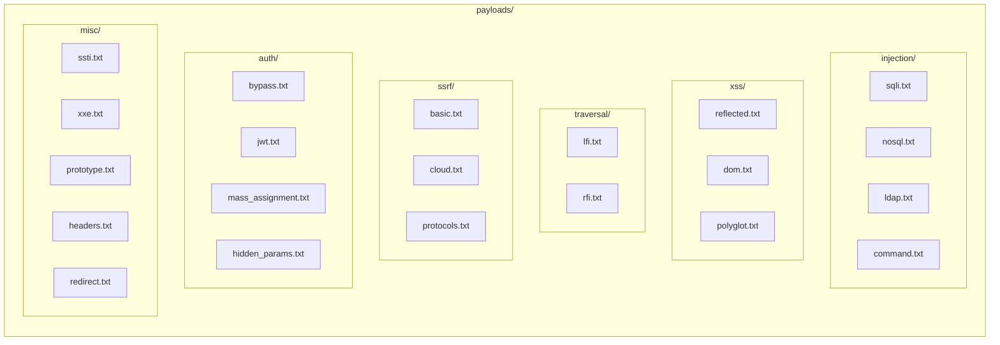

# Payloads Guide

[← Back to Index](../README.md) | [← Configuration](CONFIGURATION.md)

---

## Payload Library Structure



| Category | Files | Description |
|----------|-------|-------------|
| injection | sqli, nosql, ldap, command | SQL, NoSQL, LDAP, OS injection |
| xss | reflected, dom, polyglot | Cross-site scripting |
| traversal | lfi, rfi | Path traversal, file inclusion |
| ssrf | basic, cloud, protocols | Server-side request forgery |
| auth | bypass, jwt, mass_assignment, hidden_params | Authentication attacks |
| misc | ssti, xxe, prototype, headers, redirect | Template injection, XXE, etc. |

---

## Using Payloads

### In Python

```python
from payloads.loader import load_payloads, sqli, xss

# Load specific category
sql_payloads = load_payloads('injection', 'sqli')
print(f"Loaded {len(sql_payloads)} SQL injection payloads")

# Load all XSS payloads
all_xss = load_payloads('xss')

# Quick access functions
sqli_payloads = sqli()
xss_payloads = xss()

# Search payloads
from payloads.loader import search_payloads
results = search_payloads('UNION')
for r in results:
    print(f"{r['category']}/{r['subcategory']}: {r['payload']}")
```

### With Fuzzer

```python
from modules.zap_fuzzer import ZAPFuzzer
from payloads.loader import load_payloads

# Load payloads
sqli = load_payloads('injection', 'sqli')

# Use with fuzzer
fuzzer = ZAPFuzzer(zap_client, wordlists={'sqli': sqli})
results = fuzzer.fuzz_with_payloads(
    url='https://target.com/search',
    param='q',
    payloads=sqli,
    payload_type='sqli'
)
```

---

## Payload File Format

```
# Category: Authentication Bypass
' OR '1'='1
' OR '1'='1' --
admin'--

# Category: Union Based
' UNION SELECT NULL--
' UNION SELECT 1,2,3--
```

- Lines starting with `#` are comments
- Empty lines are ignored
- One payload per line

---

## Adding Custom Payloads

### Add to Existing Category

```bash
# Add new SQLi payloads
echo "' AND SLEEP(10)--" >> payloads/injection/sqli.txt
```

### Create New Category

```bash
# Create new category
mkdir -p payloads/custom

# Add payload file
cat > payloads/custom/api.txt << 'EOF'
# API-specific payloads
{"$where": "1==1"}
{"password": {"$gt": ""}}
EOF
```

### Update Loader

Edit `payloads/loader.py`:

```python
CATEGORIES = {
    # ... existing categories
    'custom': ['api', 'other'],
}
```

---

## Payload Categories

### Injection (`injection/`)

| File | Description | Count |
|------|-------------|-------|
| sqli.txt | SQL Injection | ~70 |
| nosql.txt | MongoDB/NoSQL | ~25 |
| ldap.txt | LDAP Injection | ~20 |
| command.txt | OS Command | ~40 |

### XSS (`xss/`)

| File | Description | Count |
|------|-------------|-------|
| reflected.txt | Reflected XSS | ~40 |
| dom.txt | DOM-based XSS | ~20 |
| polyglot.txt | Multi-context | ~10 |

### SSRF (`ssrf/`)

| File | Description | Count |
|------|-------------|-------|
| basic.txt | Localhost bypass | ~25 |
| cloud.txt | Cloud metadata | ~30 |

### Auth (`auth/`)

| File | Description | Count |
|------|-------------|-------|
| mass_assignment.txt | Privilege escalation | ~35 |
| hidden_params.txt | Debug parameters | ~40 |

---

## Best Practices

### 1. Use Targeted Payloads

```python
# Good: targeted payloads
if 'id' in param.lower():
    payloads = load_payloads('injection', 'sqli')
elif 'file' in param.lower():
    payloads = load_payloads('traversal', 'lfi')
```

### 2. Respect Rate Limits

```python
# Configure rate limiting
fuzzer = ZAPFuzzer(zap, wordlists, config={
    'rate_limit': 5.0,  # 5 req/s
    'max_payloads': 100
})
```

### 3. Log Successful Payloads

```python
for result in results:
    if result['interesting']:
        logger.info("interesting_response",
                   payload=result['payload'],
                   status=result['status'])
```

---

## Next Steps

→ [CLI Reference](../api/CLI.md)
