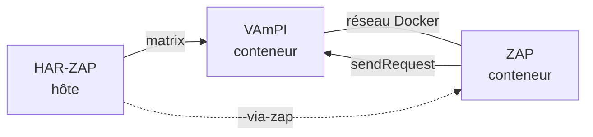

# Test terrain — HAR-ZAP contre VAmPI

Test d'intégration bout-en-bout : monte une API délibérément vulnérable
([VAmPI](https://github.com/erev0s/VAmPI)) + OWASP ZAP en Docker, génère des
HAR multi-rôles avec des jetons frais, puis joue la **matrice d'accès
multi-rôles** de HAR-ZAP et confronte les findings à la vérité terrain.

## Lancer

```bash
./examples/vampi/run_vampi_test.sh          # monte, teste, démonte
KEEP=1 ./examples/vampi/run_vampi_test.sh   # laisse les conteneurs debout
VIA_ZAP=1 ./examples/vampi/run_vampi_test.sh  # route la matrice via ZAP
```

Prérequis : `docker` (démon accessible), `python3` avec les dépendances du
projet (`requests`, `zapv2`).

## Ce que le test démontre



Findings attendus (calibrés sur les vulnérabilités réelles de VAmPI) :

| Finding | Verdict |
|---|---|
| anon atteint `/users/v1/_debug` (dump users + mots de passe) | vrai positif |
| user atteint `/users/v1/_debug` | vrai positif |
| user atteint le livre d'admin `/books/v1/<titre>` (BOLA) | vrai positif |
| anon atteint `/users/v1`, `/books/v1` | **faux positif** (endpoints publics) |

## Le faux positif est instructif

Le plancher de privilège d'un endpoint est déduit du HAR où il apparaît. Un
endpoint réellement public vu uniquement dans le HAR d'un rôle authentifié est
donc cru « réservé » → accès anonyme signalé à tort. **Correctif méthodo :**
fournir aussi un HAR anonyme couvrant les endpoints publics, pour que leur
plancher soit `anon`.

## Notes

- `/createdb` de VAmPI **randomise les titres de livres** : `genhar.py` les
  découvre dynamiquement via `/books/v1` (qui expose le propriétaire).
- Les jetons JWT de VAmPI expirent en ~60 s ; on régénère les HAR juste avant
  de lancer la matrice.
