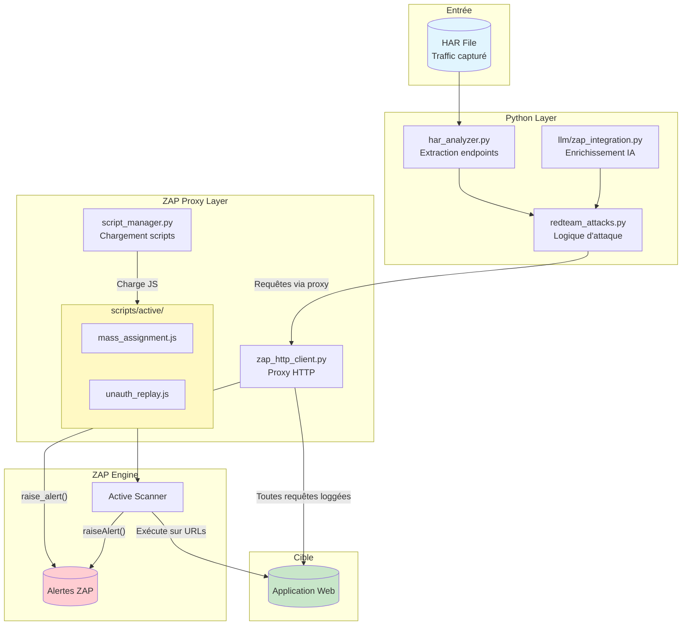
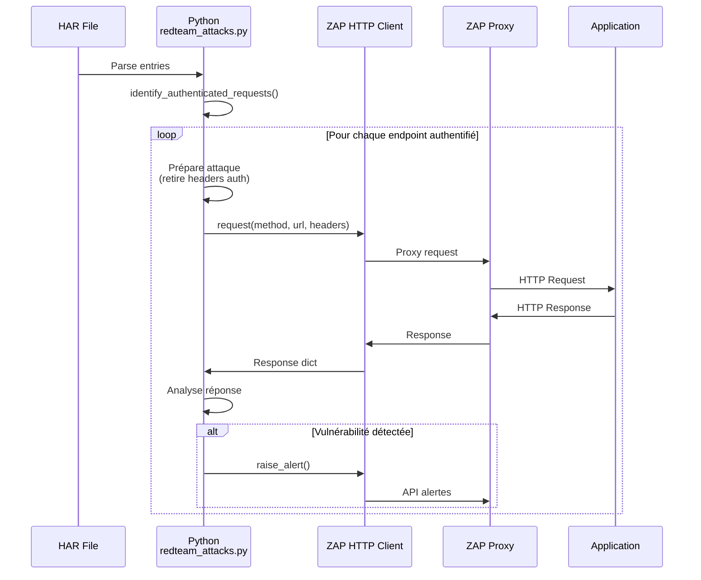
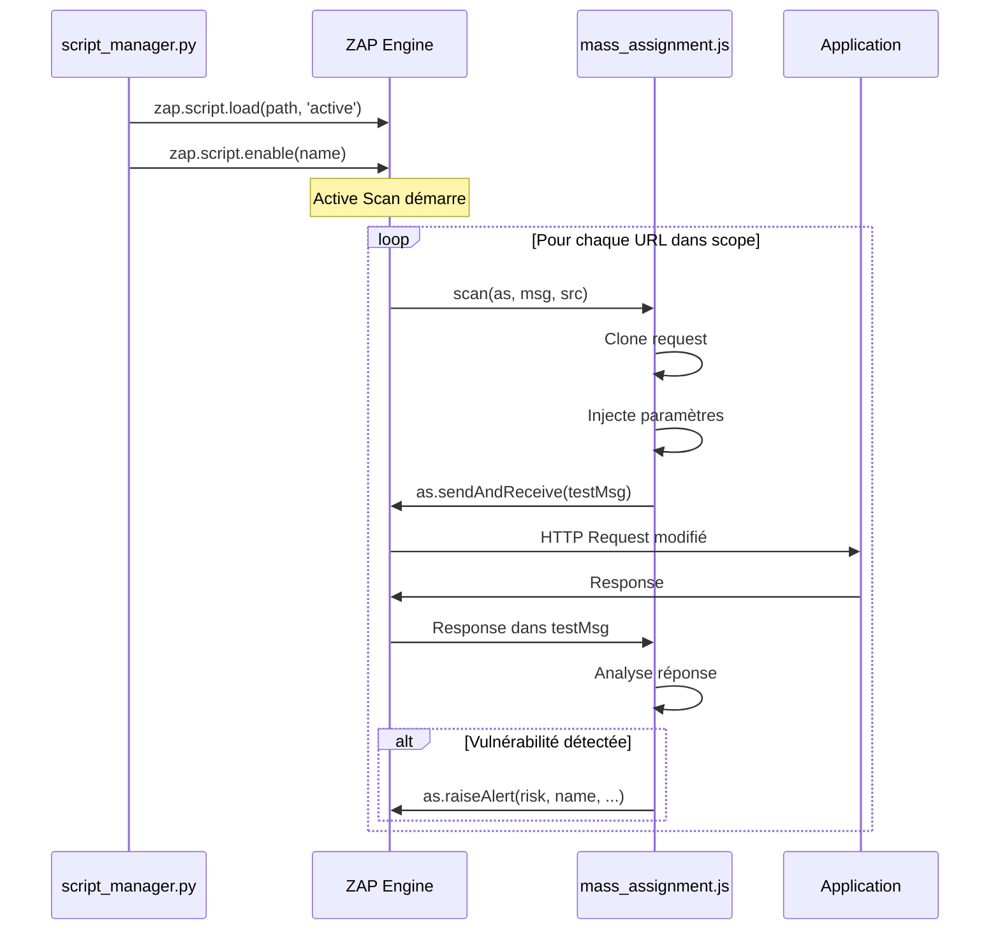
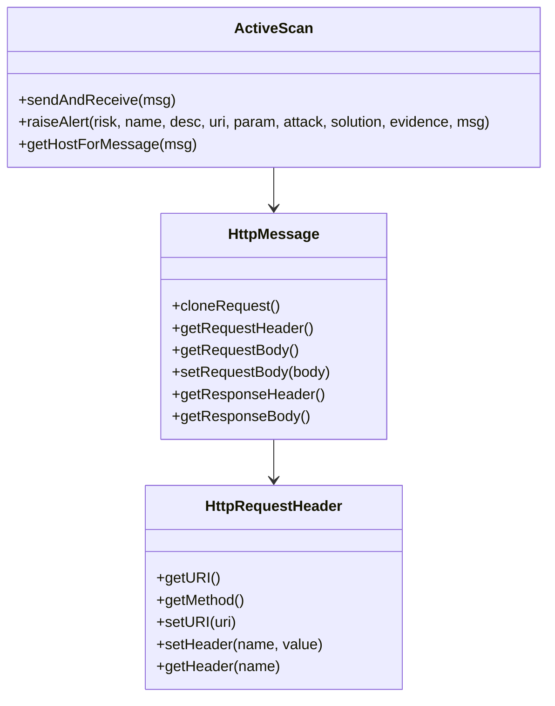
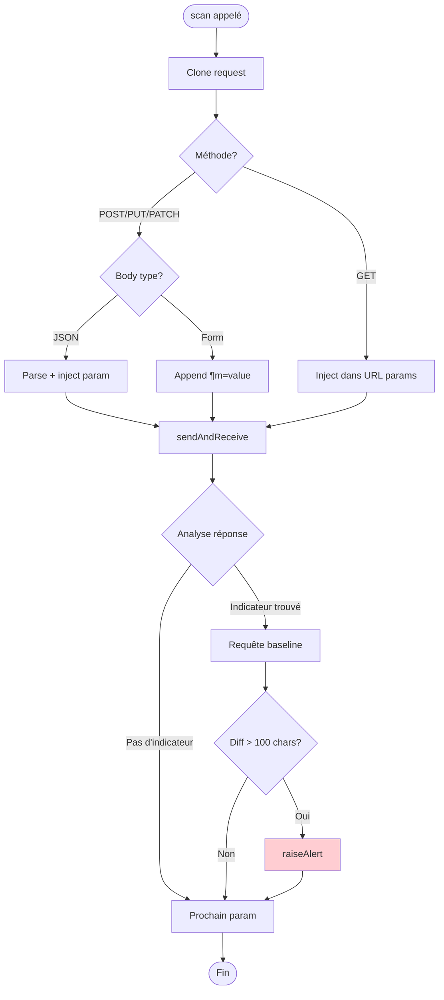
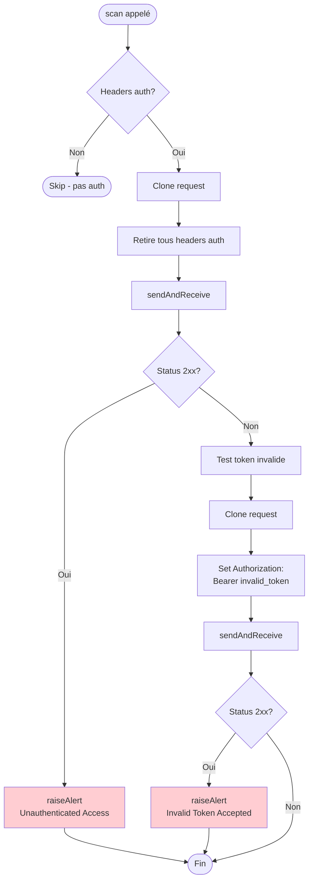
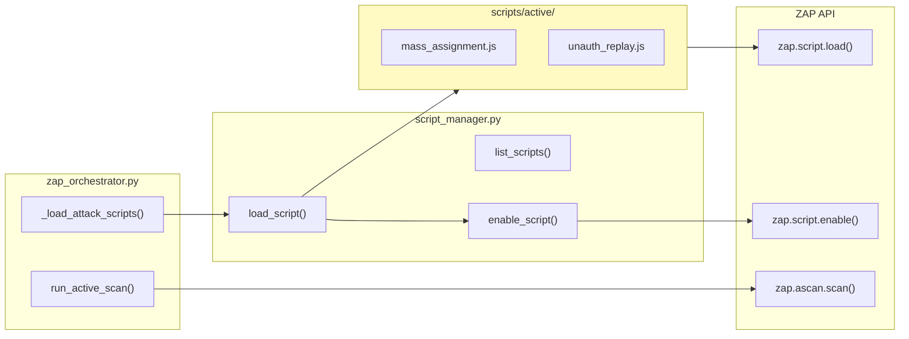
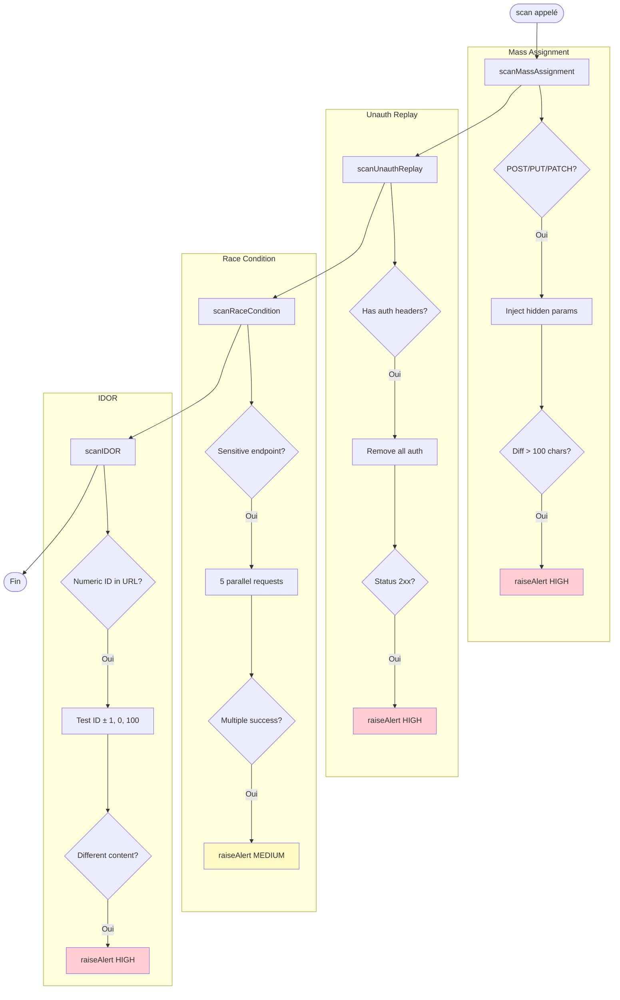

# Architecture Red Team - Pipeline HAR → ZAP

## Vue d'ensemble



## Deux chemins d'attaque parallèles

### Chemin 1: Python Direct (redteam_attacks.py)



**Avantages:**
- Contrôle total sur la logique
- Payloads complexes (JSON nested, arrays)
- Concurrence avec ThreadPoolExecutor
- Analyse HAR offline
- Tests multi-étapes (race conditions)

### Chemin 2: Scripts JS dans ZAP (scripts/active/*.js)



**Avantages:**
- Intégration native ZAP UI (History, Alerts)
- Exécuté sur URLs découvertes par Spider
- Contexte d'authentification ZAP (Replacer)
- Compatible avec Acceptance Engine
- Pas de dépendance Python runtime

## Structure des scripts JS

### Signature obligatoire

```javascript
// Active script - signature standard
function scan(as, msg, src) {
    // as  = ActiveScan helper (sendAndReceive, raiseAlert)
    // msg = HttpMessage original
    // src = Script source object
}

// Alternative avec paramètres (pour fuzzing)
function scan(as, msg, param, value) {
    // param = nom du paramètre à fuzzer
    // value = valeur originale
}
```

### API ZAP disponible dans JS



## mass_assignment.js - Détail



### Paramètres testés

| Catégorie | Paramètres |
|-----------|------------|
| Admin | `admin`, `isAdmin`, `is_admin` |
| Rôles | `role`, `user_role`, `userRole` |
| Debug | `debug`, `isDebug`, `is_debug` |
| Privilèges | `priv`, `privilege`, `permissions` |
| Accès | `access_level`, `accessLevel` |

### Valeurs injectées

```
true, 1, admin, administrator
```

## unauth_replay.js - Détail



### Headers d'authentification détectés

```
Authorization, X-Auth-Token, X-API-Key, Cookie
```

## Intégration avec le flux Python



## redteam_scanner.js - Scanner Unifié

Script principal combinant 4 vecteurs d'attaque red team:



### Paramètres cachés testés (Mass Assignment)

| Catégorie | Paramètres |
|-----------|------------|
| Privilèges | admin, isAdmin, role, privilege, permissions |
| Debug | debug, test, dev, staging, internal |
| Statut | verified, active, approved, banned, premium, vip |
| Ownership | user_id, owner_id, account_id, tenant_id |
| Finance | balance, credit, discount, price, amount |

### Patterns sensibles (Race Condition)

```
checkout, payment, transfer, withdraw, deposit,
coupon, discount, promo, redeem, apply,
cart, order, purchase, buy,
balance, credit, points, reward,
vote, like, follow, subscribe
```

## Quand utiliser quoi?

| Scénario | Python | JS/ZAP |
|----------|--------|--------|
| Analyse HAR offline | ✅ | ❌ |
| Spider + scan auto | ❌ | ✅ |
| Race conditions | ✅ | ✅ (redteam_scanner.js) |
| Intégration UI ZAP native | ❌ | ✅ |
| Payloads JSON complexes | ✅ | ⚠️ |
| Tests avec état (sessions) | ✅ | ⚠️ |
| CI/CD headless | ✅ | ✅ |
| Enrichissement LLM | ✅ | ❌ |
| IDOR enumeration | ✅ | ✅ (redteam_scanner.js) |

## Ajout d'un nouveau script

1. Créer `scripts/active/mon_script.js`
2. Implémenter `function scan(as, msg, src)`
3. Le script sera chargé automatiquement par `_load_attack_scripts()`

```javascript
// Template minimal
function scan(as, msg, src) {
    var testMsg = msg.cloneRequest();

    // Modifier la requête...

    as.sendAndReceive(testMsg);

    // Analyser la réponse...

    if (vulnerable) {
        as.raiseAlert(
            1,  // risk: 0=Info, 1=Low, 2=Medium, 3=High
            'Nom de la vuln',
            'Description',
            testMsg.getRequestHeader().getURI().toString(),
            'param_name',
            'payload_utilisé',
            'Solution recommandée',
            'Evidence (extrait réponse)',
            testMsg
        );
    }
}
```
